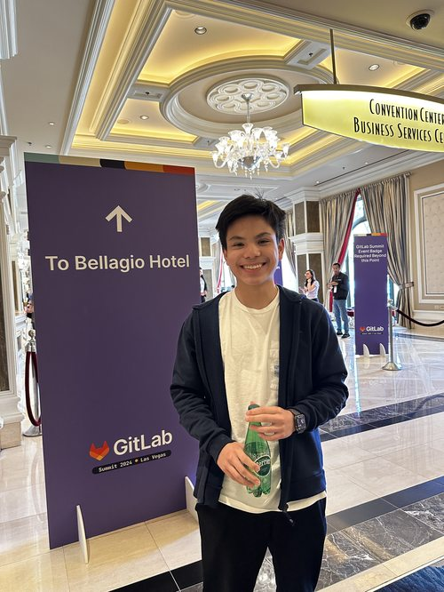

# About Me

Hello. I am Connor Cruz! I am a sophomore at Charlotte Latin School, and this is my Fab Academy Documentation. I grew up in Charlotte, North Carolina, but my family and I are from Guam.

Some of my interests include coding and learning mathematics in my free time. For coding, I have learnt several languages (some being C++, Java, Python, and JS). I've also developed some games using game engines such as Unity and Godot. In terms of math, I enjoy learning many different subjects and am currently researching Godel's Incompleteness Theorems in depth. I am a big fan of set theory, and specifically abstract algebra, but I also enjoy learning topics in the realm of Analysis.

I have always been fascinated about how things work in the world, so I hope that Fab Academy can broaden my understanding.