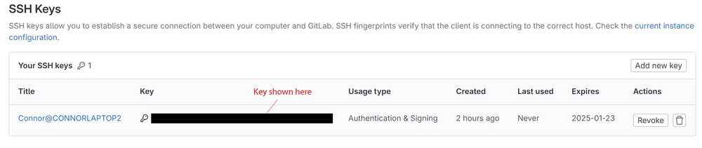
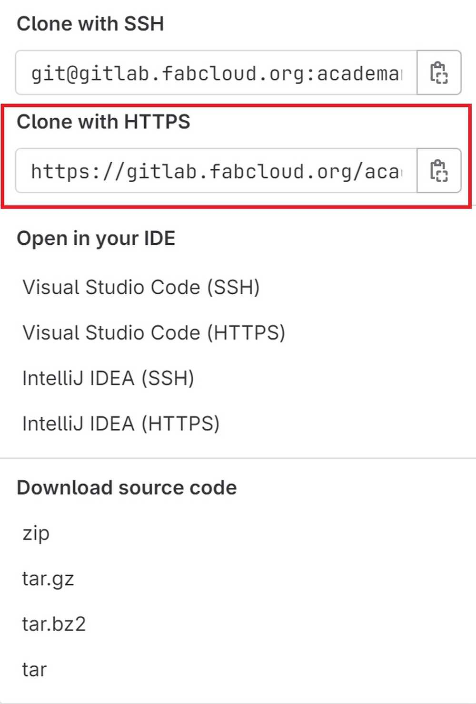
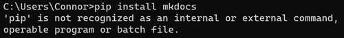
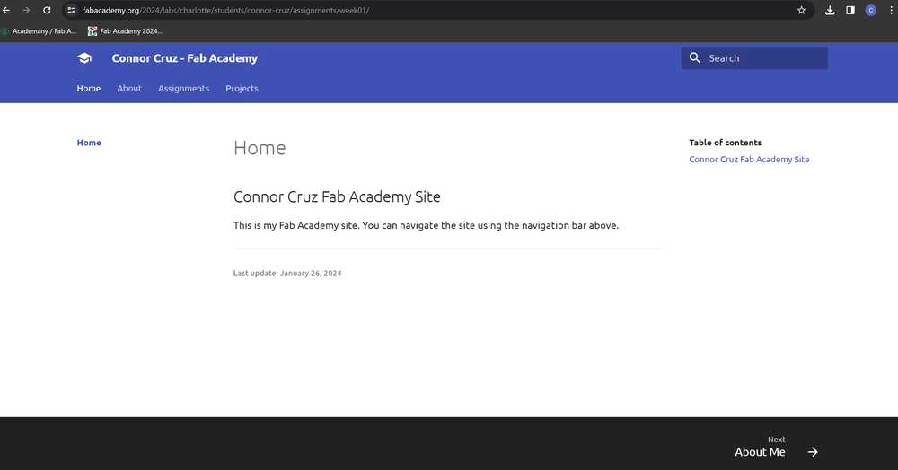
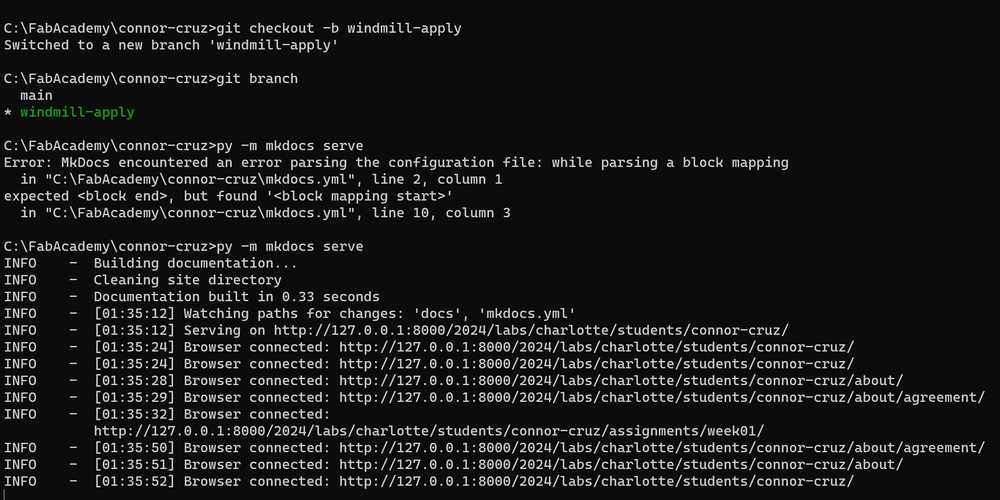
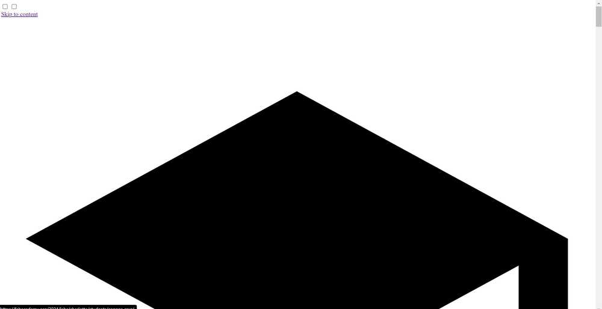
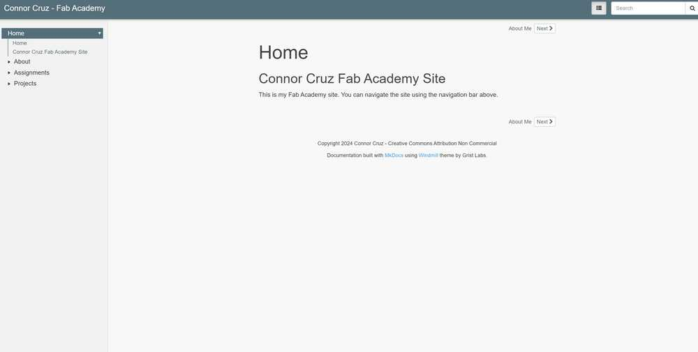
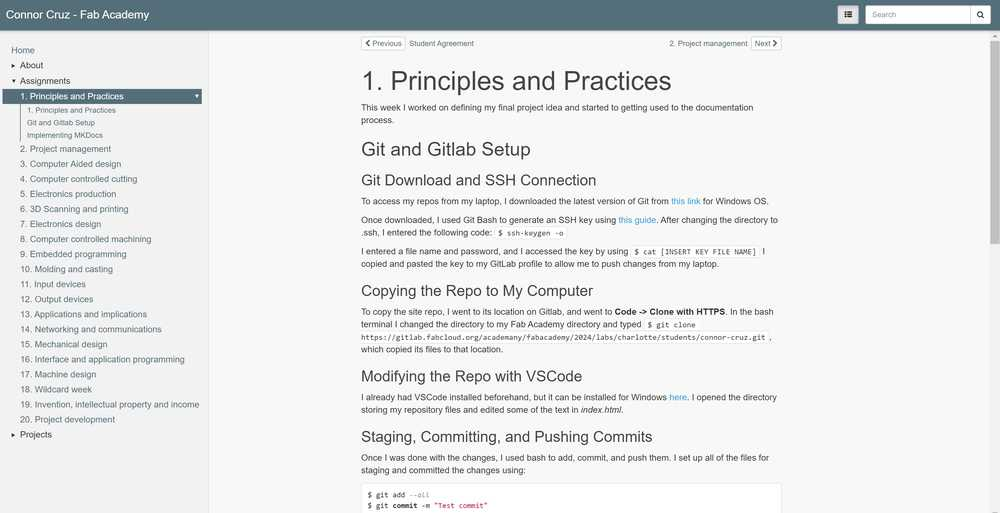
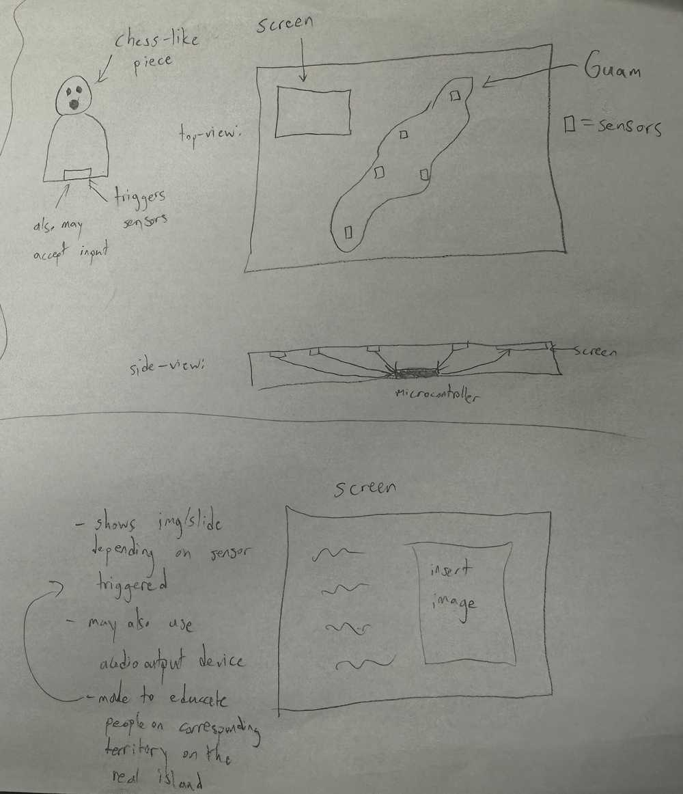

# 1. Principles and Practices

This week I worked on defining my final project idea and started to getting used to the documentation process.

## Git and Gitlab Setup

### Git Download and SSH Connection

To access my repos from my laptop, I downloaded the latest version of Git from [this link](https://git-scm.com/download/win) for Windows OS.

Once downloaded, I used Git Bash to generate an SSH key using [this guide](https://git-scm.com/book/en/v2/Git-on-the-Server-Generating-Your-SSH-Public-Key).
After changing the directory to .ssh, I entered the following code: `$ ssh-keygen -o`

I entered a file name and password, and I accessed the key by using `$ cat [INSERT KEY FILE NAME]`
I copied and pasted the key to my GitLab profile to allow me to push changes from my laptop.

Here is the SSH key after being added to Gitlab (censored for privacy).


### Copying the Repo to My Computer

To copy the site repo, I went to its location on Gitlab, and went to **Code -> Clone with HTTPS**.
In the bash terminal I changed the directory to my Fab Academy directory and typed `$ git clone https://gitlab.fabcloud.org/academany/fabacademy/2024/labs/charlotte/students/connor-cruz.git`, which copied its files to that location.

After selecting **Code**, this is the menu that pops up.


### Modifying the Repo with VSCode

I already had VSCode installed beforehand, but it can be installed for Windows [here](https://code.visualstudio.com/).
I opened the directory storing my repository files and edited some of the text in *index.html*.

### Staging, Committing, and Pushing Commits

Once I was done with the changes, I used bash to add, commit, and push them.
I set up all of the files for staging and committed the changes using:
```bash
$ git add --all
$ git commit -m "Test commit"
```

To push the changes to my Gitlab page, I used:
```bash
$ git push
```

## Implementing MKDocs

Note: I used the [official MKDocs installation guide](https://www.mkdocs.org/user-guide/installation/) to help with my installation.

### Python and PIP Installs

To download MKDocs, I first needed to install Python and PIP.
I downloaded Python for Windows directly from the [Python website](https://www.python.org/downloads/).

Next, I used `$ python get-pip.py` in Bash to install PIP.

### MKDocs Install

To install MKDocs, I orginally tried using the command `$ pip install mkdocs`, but it resulted in the following error:


I looked the problem up online, and I realized that I needed to set Python as an environmental variable. I attempted to set one to its path, but this still didn't work. Eventually, I figured out that I could simply insert *python -m* before my commands, and it would work.

MKDocs was installed through PIP with the following command:
```bash
$ python -m pip install mkdocs
```

### Adding MKDocs to Site Repo

For my site, I used the [Fab Academy Student Template](https://gitlab.fabcloud.org/fibasile/fabacademy-student-template).

I then copied the following files to my repo: *mkdocs.yml*, *requirements.txt*, *.gitlab-ci.yml*.
I also copied the *docs* folder over.

Note: I needed to replace my default *gitlab-ci.yml* file with the template file.

### Modifying with VSCode

The template was already provided with .md files, which were successfully able to modified through VSCode.
I finished by personalizing the mkdocs YAML and the index pages.

Here is my webpage after adding and personalizing the template.


### Attempting to Add Cinder Theme

I tried to add a new theme to the site called [Cinder](https://github.com/chrissimpkins/cinder?tab=readme-ov-file).

At first, I simply replaced the theme in the MKDocs YAML file with 'Cinder', but I accidentally forgot to add the cinder files to my repo. I followed the install guide on the [official Cinder demo website](https://sourcefoundry.org/cinder/), and I eventually got the theme to work.

I ultimately decided not to use the theme because of the dropdown menus which come from the navigation bar (some went off of the page).
I reverted the site back to its default theme afterwards.

### Adding Windmill Theme

The next theme that I tried to add was [Windmill](https://github.com/gristlabs/mkdocs-windmill).

I downloaded the mkdocs_windmill directory from the sample page, and I pasted it into my repo after creating a new branch for testing.

I also changed the value of *name* in the MKDocs YAML to **null** and changed *custom_dir* to **mkdocs_windmill**.

Initially, my push resulted in an error due to forgetting to save the YAML file, but it was fixed afterwards. For some reason, the formatting of the page was not working despite looking fine when using `$ py -m mkdocs serve` locally.

MKDocs Serve Command:


Error with Cinder formatting:


I tried deleting and adding the mkdocs_windmill directory back into my repo, and I pushed again. For some reason, the website now looked as intended. I do not know why this method of fixing it worked, but I suspect that it was due to me accidentally changing a file in mkdocs_windmill and forgetting to change it back. Once the change was successful, I merged the branch.

Here are some images of the site after the theme change.



## Final Project Planning

### Overview

My final project idea is designed to help teach the culture of my home island, Guam, to those who do not know as much about it.

The project consists of a board (roughly 2' x 1.5') that has an OLED screen along with a map of Guam. To accompany the board, there will also be a piece similar to a chess pawn.

The island of Guam will have sensors at cultural landmarks, and when the pawn piece is placed on those sensors, there will be a two-way response. The sensor on the board will control the screen and cause it to show an image or images related to the location and providing information.
The pawn-like piece will also have a sensor that, when triggered, will output an audio recording to go along with the information on the board.

Here is a very rough picture representing the basic layout of the board and piece.



### Similar Project

Mr. Dubick recommended a similar final project made by [Elaine Liu](https://fabacademy.org/2020/labs/charlotte/students/elaine-liu/).
Her project can be found [here](https://fabacademy.org/2020/labs/charlotte/students/elaine-liu/projects/final-project/).

Her project consisted of a map of the world with sensors. When the sensors are touched, media relating to that place is shown on a screen.
Since the project is very similar to mine, I will most likely reference hers throughout my development.

### Planned Use of Weeks

Once I talked to Dr. Taylor about my project idea, we were able to form a rough plan of weeks I could use to develop my project:

- Cad Week (Week 2) - creating the general design and dimensions
- Computer Controlled Cutting (Week 3) - laser cut parts for cable management
- Electronics Production (Week 4) - create sensors, triggers, and screen piece
- 3D Scanning and Printing (Week 5) - create holders for screen and sensors; possibly also use for piece design
- Embedded Programming (Week 6) - program microcontroller to control screen and audio
- Computer-Controlled Machining (Week 7) - designing the general box
- Electronics Design (Week 8) - continue to design sensors and screen components
- Output Devices (Week 9) - programming screen and speakers for audio
- Input Devices (Week 11) - making sensors on the board respond with the piece
- Molding and Casting (Week 12) - creating rubber feet for the board

## Reflection

This week, I learned how to use Git and Gitlab, as well as how to include Markdown as part of repositories. I also learned how to customize the Markdown theme and edit files in directories easily with VSCode. I also got accustomed to using my computer's command line, Git Bash, and PowerShell to navigate directories and run commands. I also had an opportunity to think about my final project, and I feel like I have a fairly good idea of how I can apportion my weeks to work on it. Overall, I felt that I did not have many problems this week.

## Credits

Thank you to Adam Stone for his [image compressor](https://fabacademy.org/2023/labs/charlotte/students/adam-stone/lessons/prefab/image-resizer/). It is very simple and efficient. Also thanks to Mr. Dubick and Dr. Taylor for helping me figure out my final project.