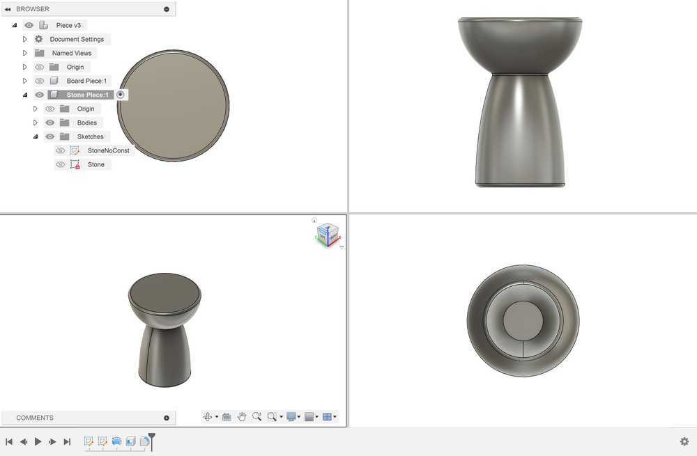
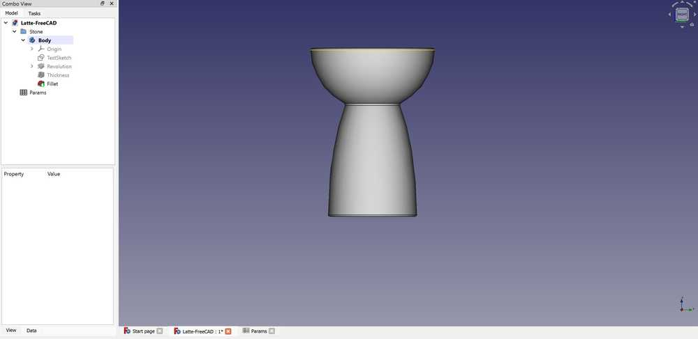
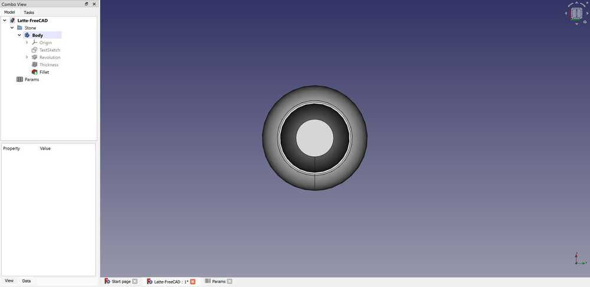
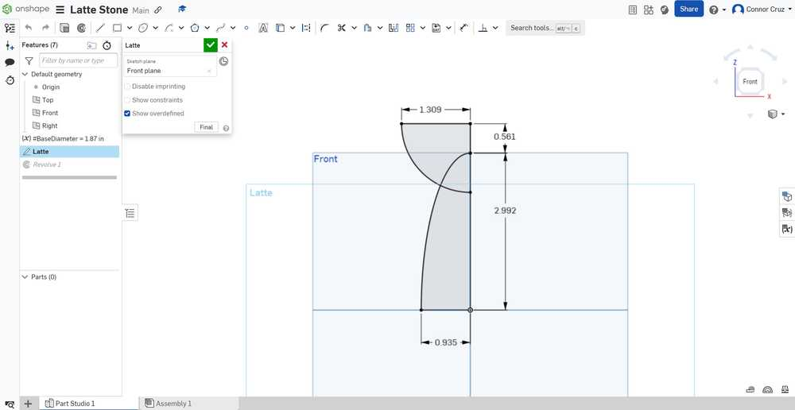
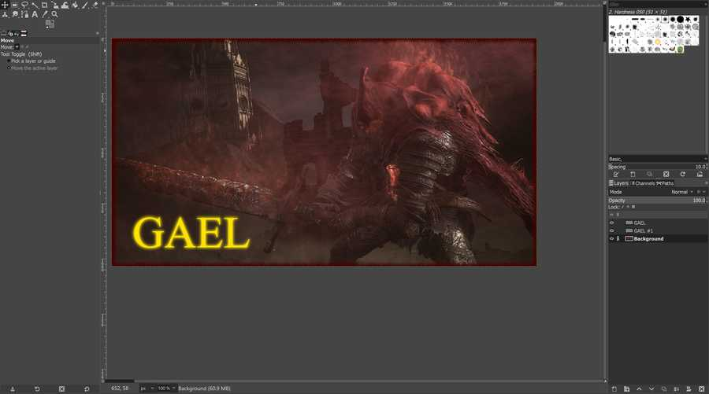
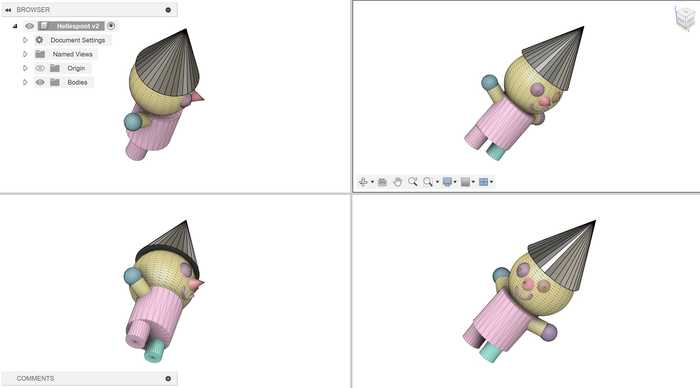

# 2. Computer Aided Design

This week I worked on using different CAD programs to model my final project and deciding which would be best to use in the long term.

You can find the files used this week [here](../files/Week02-Files.zip).

## Piece Modeled

I chose to model the piece that would be placed on my board this week.

**Note a slight change:**
I originally had the piece designed as a person or a chess pawn-like piece, but I decided to change it to a [Latte Stone](https://en.wikipedia.org/wiki/Latte_stone), which is a symbol of my heritage from Guam. I chose this design because it would look nicer if it were to be modeled (the face of the pawn might come out a bit messy or uncanny), and it also further lends to the point of the project.

## Piece Modeling (Before Change)

Before changing what my piece would look like, I sketched and extruded its rough bodily dimensions. Details on how I made the ellipse part of the design can be found in the **Using Fusion 360** section, since the steps were essentially the same (except for a couple of different dimensions). I also added a rectangle for the neck of the piece and a circle coincident with the neck to act as a head. However, while I was designing the head, I decided that the base reminded me of the Latte stone and it would also be a nicer design choice.

Old design body sketch:

Stopping point:

## Using Fusion 360

Fusion 360 was fairly easy to use to design my piece.

I started off by creating a parameter to determine the length of the base of the piece labeled BaseDiam, and I set its value to 47.5 mm. I then created a new component to store the piece. I used the BaseDiam parameter to construct an ellipse for the base of the Latte stone, with the length of the minor axis set to BaseDiam.

After constructing the base and using appropriate dimensions and constraints, I then added a circle on top of the semicircle for the top of the Latte Stone. I also added some lines diving it in half and cutting off the circle so that I could use the revolve tool on the sketch.

Throughout the process of making this, I ensured that my dimensions were determined parametrically with respect to the base of the Latte stone. That way, if I ever needed to change the length of the piece, my other dimensions could easily adapt.

After finishing the sketch, I revolved it around the vertical axis. I shelled the bottom of the piece in order to store any electronics I might need. Then, to finish off my design, I added 2 mm fillets to the top and bottom edges, and I added a 1 mm fillet to the intersection point.

There were not any major problems in designing the object in Fusion 360. The only slight issue was attempting to find underconstrained elements. I watched [this tutorial](https://www.youtube.com/watch?v=matqB8nGzQI), and I followed the instructions to see underconstrained elements. Despite taking a little bit of time, it will be fairly easy to do this process in the future.

Here is the process used to see underconstrained elements:

## Using FreeCAD

I watched and followed several tutorials on how to navigate FreeCAD such as [this video](https://www.youtube.com/watch?v=sxnij3CkkdU).

I first figured out how to create parameters, which could be achieved by making a spreadsheet in the tree view and editing its values. I really liked this method of defining parameters, since it can be customized as much as you want and it is easy to navigate.

I created a new body and a new sketch, and I tried creating the same design as in Fusion 360. It was slightly strange applying constraints since some of them did not allow me to apply them. For example, it would not let me make a dimension between two points. 

I eventually got the constraints to work, and I tried to revolve the design. However, I got this error when trying to do it:

I also could not select specific regions of the sketch to revolve. I looked the problem up, but I could not figure out how to do it. Ultimately, I ended up redoing the sketch with only the regions that would be revolved. I created an elliptical arc for the base and a circular arc for the head. This was not too much of a problem, but some constraints were not decreasing the degrees of freedom when they should have. I eventually got the sketch to fully constrain, but I was still not able to revolve it.

I was able to fix the problem by using the **trim edge** tool to cut off lines that were unnecessary to the revolve. To compensate for them, I also made a constructing line and set its dimension as a placeholder to fully constrain the sketch.

I then successfully revolved the sketch and used the **Thickness** tool to create a 2 mm inner shell. I struggled at first to do this since I accidentally had an outer shell selected, but I fixed the error fairly quickly. To finish the design, I added fillets to the edges.

Here are images of the final design:

FreeCAD was very hard to understand, and I still do not understand some aspects of what I designed. Fully constraining the object made little sense to me, and it was difficult to navigate each menu.

## Using Onshape

Onshape felt really easy to use after having experience with other CAD programs. I was able to design my component with no need to watch a tutorial due to similarities to Fusion 360.

I first tried to figure out how to create a variable (parameter). I created a variable, which was placed in my design hierarchy. Later, I figured out that I could have made a variable global by using *Variable Studios*. I named the variable BaseDiameter, set it to 47.5 mm, and moved it into the part of the hierarchy where the piece was.

The sketch was very simple to design and constrain. I tried to design my piece in the same way that I designed it in Fusion 360 (requiring me to select specific parts of the sketch for the revolve). I created the ellipse and circle shapes with no problems, and there were also no problems with constraints. It was really easy to find unconstrained elements since they were highlighted blue as opposed to black.

The revolve tool also allowed me to select only specific parts of a sketch, so I was able to do it with no problems. I then applied the shell to the bottom face and fillets on their respective edges very easily.

Finished design images:

[Here is the link to my design.](https://cad.onshape.com/documents/4dc79aa2fea85fb71be87921/w/7eb547e2b6cb0060e8cb6beb/e/dd0e1175efb71fae76b44aaf)

There were no problems encountered while using Onshape, but I do not like the fact that it requires a constant online connection to use.

## Overall Pros and Cons of Each Program

### Fusion 360

Pros:

- Prior experience with the software
- Neat component management
- Timeline of previous tools used in a component
- Easily accessible search menu
- Parameters menu easy to access and edit

Cons:

- Slightly tedious to see underconstrained elements

### FreeCAD

Pros:

- Able to keep parameters in a neat spreadsheet with descriptions and other things you want to add

Cons:

- Complicated menus and UI
- Can't figure out how to only select part of a sketch
- Requires constraints for seemingly unnecessary things (e.g. defining dimensions for both minor radii of an ellipse)
- Adding constraints is complicated and doesn't work as intended sometimes (e.g. adding dimensions between 2 points)
- Hard to search for specific tools or commands

### Onshape

Pros:

- Extremely intuitive interface
- Easy to see underconstrained sketch elements (highlighted blue)
- Easy to search for tools

Cons:

- Can only use with online connection
- Somewhat complicated to manage assemblies

## CAD Program Choice

I'm sure that with enough experience and watching enough tutorials on FreeCAD, I could get a better understanding of how to use it decently, but for the sake of time and efficiency, I do not think that it will be viable to use for Fab Academy. Onshape was very easy to learn after already having used CAD programs. Although Onshape's features are very easy to use, I feel like Fusion 360 would be best to use due to my prior experience and its relative simplicity in relation to software such as FreeCAD.

## Vector Program - Cuttle

I used a built-in tutorial to learn the basics of Cuttle. Here is the shape that I made with the tutorial:

I wanted to make a basic design of the board where my final project would go. To start, I made a box that was 20 x 27 in for the border of the board. Next, I wanted to create an outline of the island of Guam. I did not know how to trace a bitmap in Cuttle, nor could I find a tutorial on how to do it, so I made a bitmap of Guam in Inkscape and exported it to Cuttle. I rescaled Guam to fit nicely inside of my box shape, which was very simple to do. Centering was also easy, since the midpoints of each path were visible, and I could just place them on top of each other. Finally, I made another square to roughly hold a 7 x 5 in small screen. Here is the final design.

## Raster Program - GIMP

To help guide me through GIMP, I used [this tutorial](https://www.youtube.com/watch?v=fPcpnLcyGxQ).

I wanted to modify an image of Slave Knight Gael, which is a character from the video game [Dark Souls III](https://store.steampowered.com/agecheck/app/374320/). The image I used can be found on [the Fandom site](https://darksouls.fandom.com/wiki/Slave_Knight_Gael).

Here is the original image:

To start the design, I opened my desired image as a new GIMP file. I navigated the menus for a bit to see what I could do, and I decided to add a blurred border to the image, which could be done with **Filters -> Decor -> Fuzzy Border**. I chose to make it dark red, since that would complement the image best.

I next added a layer of fog over the image. To find the Fog tool, I went to **Filters -> Decor -> Fog**. I set the transparency to around 40% and made it have a light red color, which caused the fog to be subtle but add nicely to Gael's outline and the background.

Fog option menu:

Image with fog and border:

To finish off the image, I chose to add yellow text saying "Gael" to the bottom left by creating a new layer and using the **Text Tool**. 

I also wanted a glowing effect on the text, so I followed [this tutorial](https://www.youtube.com/watch?v=fPcpnLcyGxQ). I duplicated the text into a new layer, selected that layer, and went to **Filters -> Blur -> Gaussian Blur** to create my desired effect.

I feel like the modifications I made to the image made it more like a teaser image for the game than an actual image from the game, which was my intended effect. Here is the final image:

Note: I did not include the **.xcf** file that held the GIMP design because it was too large to include. The image above is a compressed version of the image exported from the file.

GIMP was very easy to use because of prior experience creating raster images with programs such as Photoshop, and I feel like it will be good if I need to quickly edit an image to place on my site or make it slightly nicer.

## Gravity Sketch

On Monday (2/5/24), I and others at the Charlotte Latin Fab Lab used VR headsets to use [Gravity Sketch](https://www.gravitysketch.com/). Gravity Sketch is a program designed to make models in a 3D interactive environment.

Here is one of the VR headsets (Oculus Quest 2). Thanks to Collin Kanofsky for providing the image.

I worked through the tutorial on the **Learn** tab and I figured out how to use the basic modeling tools. After that, I designed a person made of basic 3D shapes. I worked through using the 3D object drawing tools, line drawing tool, and the tool to change the color of objects.

Exporting the file to a computer was a slight challenge. I first tried to upload the design file directly to my computer from the VR using a cable connection. However, I was not given administrator priveleges on the VR headset, which prevented me from linking the files on the headset to my computer.

Instead, I had to login to my school's Gravity Sketch account and export it to the account's online files. Once I exported the design from the Gravity Sketch app as a **.obj** file, I opened [the Gravity Sketch website](https://landingpad.me/), logged in, and downloaded the file from there.

Here is the design I made imported into Fusion 360:

## Reflection

This week, I refreshed my knowledge on using Fusion 360 and learnt two new CAD programs: FreeCAD and Onshape. FreeCAD was very challenging to use, so I don't think that I will use it again for CAD anytime soon. Onshape was very easy to use, but its reliance on online connection makes it slightly worse than Fusion for me. I tried out a vector program called Cuttle as well, which was very simple to use but lacked some features which would help a lot. I also learned how to edit raster images via GIMP. GIMP has a very simple UI, and its features are slightly limited, but they are very easy to learn. Finally, I also learned how to 3D model with Gravity Sketch in virtual reality. Gravity Sketch seems great to use for sketching an idea and wanting to visualize it, but I do not think that it is reasonable to use it to make polished or more complex CAD designs. Overall, I learned how to use several programs fpr digital design, and I now have a better idea of what programs I can use depending on my circumstances.

## Credits

Once again, thanks to Adam Stone for his image compressor. I will likely be using it as I go on with my documentation.