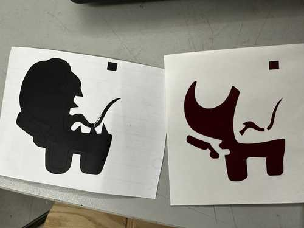
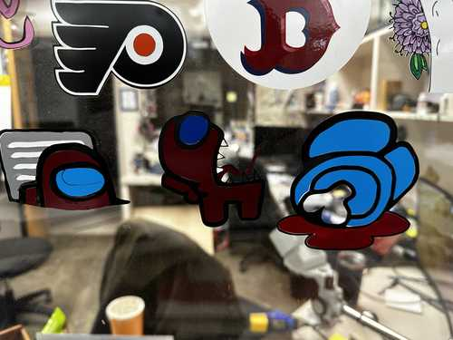
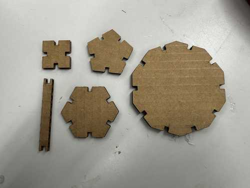

# 3. Computer Controlled Cutting

This week I worked on using different computer controlled cutting devices and designing a parametric design kit.

You can find the files used this week [here](../files/Week03-Files.zip).

## Group Project - Laser Cutter Characteristics

My group's project for Week 3 can be found [here](https://fabacademy.org/2024/labs/charlotte/assignments/week03c/).

I worked with Landon Broadwell, Ryan Zhou, and Evan Park.

The group portion of Week 3 was to describe the following characteristics of our lab's laser cutter: focus, power, speed, rate, kerf, joint clearance and types.

I worked on the kerf and joint types.

To measure the kerf of the laser cutter, I designed 10 squares in CorelDRAW measuring 25.4 x 25.4 mm. When cut, I then measured the widths and heights of each square, and I took the average of their values. Finally, I subtracted that value from 25.4 mm to get the approximate kerf.

For joint types, I analyzed the hold, durability, and ease of implementation for each of them.

## Vinyl Cutter - Sticker

I decided on my sticker design with two colleagues: [Collin Kanofsky](https://fabacademy.org/2024/labs/charlotte/students/collin-kanofsky/) and [David Vaughn](https://fabacademy.org/2024/labs/charlotte/students/david-vaughn/).

We settled on making each of our stickers represent a character from the video game [Among Us](https://store.steampowered.com/app/945360/Among_Us/). I chose mine specifically to represent an Among Us character with its tongue out. Here is the image I used:

I first imported the image into Inkscape. I was slightly confused on how to create a bitmap for the design since when I tried, it would only to the outline of the entire image rather than separating it by color. Eventually, I managed to get each color to separately outline, but there were two lines for each when there should have been one.

I manually deleted each repeating path, which was slightly tedious but fairly easy to do. I then set the line width to hairline for each path, and I exported the file as a **.dxf** file so I could import it into Silhouette Studio.

From this point on, I used [this tutorial](https://www.youtube.com/watch?v=y1TYrg1WjX8) on how to make multi-color vinyl decals.

I imported the file into Silhouette without any problems, and I proceeded to gather a white sheet for the teeth, blue sheet for the goggle, red sheet for the basic body color, and black sheet for the outline. I placed each sheet on a cutting sheet, and I used a CAMEO Vinyl Cutter to cut the parts pertaining to that color.

Here is a video of cutting the black part of the sticker.

<video width="500" height="889" muted controls><source src="../../videos/week03/Week03-BlackCut.mp4" type="video/mp4"/>The video is not supported in your browser.</video>

I weeded each of the colored sheets so that only the parts that I wanted transfered remained.

After that, I used transfer tape to move the red part of the sticker on the black part, and since the blue part was short, I moved it on manually without transfer tape. I also decided against using the white teeth due to their small size and the fact that I could simply make them transparent.

Red Part on Black Part:

Once I transposed each of the sheets on each other, I placed a final layer of transfer tape on them.

I then applied the sticker to the window where all of the Charlotte Latin Fab Lab's stickers had gone, and I ensured that my sticker was next to the other Among Us Stickers.

My Final Sticker:

Other Among Us Stickers:

## Parametric Design Kit - Design File

I used Fusion 360 to parametrically design my kit. When starting to think about what pieces I would design, I defined parameters for groove depth, groove width, and side length for the pieces. I determined the groove width using the joint clearance portion of the group part (3.5 mm). Here are the respective values for each parameter:

When actually designing pieces, I first made a square piece since it seemed simple, and I could model other pieces relative to it. My plan was to create a single side then use a circular pattern to rotate that side 4 times and create a square. I created two horizontal lines with a groove going downwards. I then added a chamfer to the outside corners of the groove, and I set constraints so that each dimension was relative to the parameters and other dimensions.

Finally, for the circular pattern, I needed to figure out how to find a center point to revolve around. To solve this, I created two construction lines connecting to each other and the ends of the edge. I set the angle between them and the edge to 45 degrees and set them equal to each other, and their intersection was the center point. I finished the square by using a circular pattern to revolve the edge 4 times around the center.

The other shapes that I created were primarily based on the edge used to create the square piece. I only had to change two things to accomodate for regular polygons of larger size: changing the angle of the construction lines and changing how many of the edge I would duplicate with the circular pattern. For the angles, I used the formula: **(n - 2) * 90 / 2** to find the angle in degrees, where n is my desired amount of sides. With this formula, I created a regular pentagon, hexagon, and decagon (note that the side lengths of each shape are the same as the square due to that being unchanged).

Pentagon:

Hexagon:

Decagon:

Next, I designed connectors for each piece type. I started by creating a simple linear connector with grooves on opposite sides of it and a length the same as the square piece. I just designed one half of the connector and mirrored it along the center to the other side.

I also wanted to design a connector that could bend easily. I followed [this tutorial](https://www.youtube.com/watch?v=0jBgl4yxmaQ) to get a general idea of how it could work. I copied the previous connector piece and made it roughly 2.5 times longer. Next, I added lines on the alternating between the edge and center of the cardboard to create the bendable parts.

## Parametric Design Kit - Laser Cutting

Once I was done designing my pieces in Fusion 360, I exported the sketch as a **.dxf** file. After exporting, I used the computer linked to a Fusion M2 Epilog Laser Cutter to open the file in CorelDRAW, and I sent the job to the printer as it was (each piece next to each other and one of each). I laser cut my pieces on cardboard.

The initial cut finished with no problems, and suprisingly, the slots for my pieces fit perfectly into each other. I designed a quick shape with my pieces as a placeholder.

Here are the initially cut pieces (the small connector fell through the laser cutter bottom):

Placeholder shape:

I then edited the CorelDRAW file to include multiple of the same pieces: 3 bendable connectors, 12 short connectors, 4 square pieces, 3 pentagonal pieces, 2 hexagonal pieces, and one decagonal piece. I used the same process as earlier to laser cut the pieces on cardboard, and all of them came out well.

<video width="700" height="400" muted controls><source src="../../videos/week03/Week03-LaserCutVideo.mp4" type="video/mp4"/>The video is not supported in your browser.</video>

With some pieces, since I had 3 bendable ones, I made a fishing pole out of them.

Then, with all of my pieces, I tried to make a humanoid shape (somewhat successfully).

## Reflection

This week was probably the most fun I have had so far. It improved my skills in using parameters in modeling to allow for ease of change, and it also generally made me more accustomed to CAD programs. I also learned how to make a multi-color vinyl decal and had some more experience with vector programs like Inkscape and CorelDRAW. I did not enjoy making the vinyl sticker as much, but it was nice to collaborate with my peers. I also learned about kerf of a cuttin tool for the first time, which will most likely help in future designs.

## Credits

All credits are mentioned where they are used respectively. Once again, credit to Adam Stone for his image resizer.