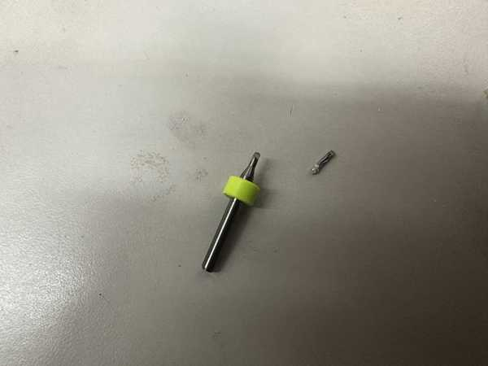
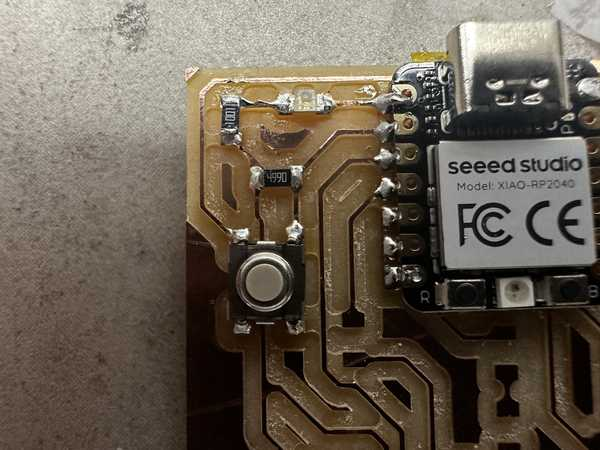

# 4. Electronics Production

This week I milled, assembled, and programmed a microcontroller development board and characterized my Lab's milling machines.

You can find the files used this week [here](../files/Week04-Files.zip).

## Milling the Microcontroller Development Board

The board I milled was the suggested board: the [Quentorres](https://gitlab.fabcloud.org/pub/programmers/quentorres).

I obtained the design for the board from the Charlotte Latin Fab Lab instructors, and used the Bantam Tools software to operate the milling machine. To start, the Fab Academy students at Charlotte Latin were shown how to use the software, and we created a workflow based off of that. That workflow was used throughout the process of making the PCBs.

We also tried to mill a sample board, but it failed for somewhat unknown reasons. Here is the failed board:


To mill the design, I used 1/64", 1/32", and 1/16" bits to cut with my desired width. I placed two-sided tape on a copper sheet and placed that sheet inside of the milling machine. Next, I installed the 1/64" bit into the spindle and probed it to get its depth. I then selected for there to be no holes in the design (since they were unnecessary for the board), and I generated the G-Code for the milling process. ?I positioned the cut so that it was on the bottom left corner of the board (offset 4" in both x and y directions), and I started the job.

Partway through, the software required me to change the milling bit to the 1/32" and later the 1/16" bit, so I changed the bits and resumed the process. Once the board was done milling, I kept the copper pad in the machine, and I, along with David Vaughn, proceeded to mill 3 more boards.

Part of the milling process:

<video width="400" height="712" muted controls><source src="../../videos/week04/Week04-Milling-MillBoard.mp4" type="video/mp4"/>The video is not supported in your browser.</video>

One finished board:


Once all of the boards were done, I took one of the boards, removed the two-sided tape, and I made sure that it was clean. This would be the board that I would continue to use.


## Problems While Milling

The bit broke two times while I was milling (one 1/64" bit and one 1/16" bit).

The 1/64" bit broke during the tool installation process. The spindle was placed above an empty spot of the bed. and it began to move down to measure how deep the bit was inserted and its general length. However, even when the tip of the bit hit the bed, the spindle continued to move down, causing the bit to break. 

Mr. Durrett suggested that this was due to a failed electrical connection between the bit and the spindle, so I used alligator clips to connect them together. Once I obtained a new bit and inserted it, along with placing the alligator clips on the bit and the spindle, it was able to install properly.

Alligator clips on milling machine:


The 1/16" bit broke during the final part of milling one of the boards. The milling process seemed to be going fine until that point, but the bit suddenly snapped while milling. I am unsure of why this happened because I ensured that the tool was installed correctly, the tool's length was measured correctly, and the depth of the copper was still measured to be the same.

Broken 1/16" bit:



## Soldering Components on the Board

Here is a picture of my parts list with the parts next to their respective labels.


Before soldering  the Xiao RP2040 chip, I made sure to place capton tape across the small nodes since I did not intend for them to conduct electricity.


I soldered the Xiao RP2040 chip and a couple of diodes and resistors with no problems. I tried out using a solder pump for soldering, when soldering the chip, which was very efficient. However, I think that I would prefer using solid solder due to the ability to both place the solder and heat it at the same time.




Once I soldered one of the LEDs below the RP2040 chip, I realized that there was supposed to be a 1K Ohm resistor in its place. 


I removed the LED, but I accidentally ended up ripping a trace linking it to another LED. I tried to put solder in that spot, but it wouldn't stick. 

Ripped trace (Middle of the board):


To fix this problem, I obtained a small wire and soldered it to the end of the LED (not the one that was removed) and the resistor to make the connection that the trace would have made. 

Fixed trace (before cutting excess):


Once I was done, I tested its conductivity, and it was successful.


I soldered the rest of the components with no problems. Here is a picture of the final soldered board.


## Programming the Board

To program the board, I downloaded the [Arduino IDE](https://www.arduino.cc/en/software) onto my computer.

Next, I plugged the XIAO RP2040 onto my computer using a USBC cable, and I reset the board by holding buttons R and B.

I unplugged it and plugged it in again, but for some reason, the board was not turning on despite it turning on earlier. I was told by Mr. Dubick that there might be a short in the part of the board where there should have been holes. I checked for conductivity between the points, and it was confirmed that there was one. To fix this, I used a razor blade to cut the copper between each circle, and the board worked well.


On the Arduino IDE, I made sure to install the RP2040 package in **File->Preferences->Additional Board Manager URLs** and set my current board to the *Seeed XIAO RP2040*. I also changed my port to the one that the chip was plugged into. First, I wrote some code to make the LEDs light up in an alternating pattern, disregarding the switch on the board.

Here is my code for that section:

```C
void setup() {
  //Sets up pins with LEDs for output
  pinMode(26, OUTPUT);
  pinMode(0, OUTPUT);
  pinMode(1, OUTPUT);
}

//Repeats code inside indefinitely
void loop() {
  //Turns each LED on, waits 100 milliseconds, turns it off, and turns on next one
  digitalWrite(26, HIGH);
  delay(100);
  digitalWrite(26, LOW);
  digitalWrite(0, HIGH);
  delay(100);
  digitalWrite(0, LOW);
  digitalWrite(1, HIGH);
  delay(100);
  digitalWrite(1, LOW);
}
```

I tested out the code, but for some reason, my 3rd LED was not working.

<video width="720" height="480" muted controls><source src="../../videos/week04/Week04-Programming-BrokenLight.mp4" type="video/mp4"/>The video is not supported in your browser.</video>

I realized that I had not soldered the corresponding pin of the RP2040 to the board, so I quickly did that. I tested it again, but the LED still did not work. I really quickly tried a conductivity test on both sides of the LED, and it did not go through at all. Since it was probably a bad LED, I replaced it and everything lit up fine.

<video width="720" height="480" muted controls><source src="../../videos/week04/Week04-Programming-ThreeLight.mp4" type="video/mp4"/>The video is not supported in your browser.</video>

Next, I modified my code to only turn on the LEDs when the tactile switch on the board is pressed. I looked up how to do it, and I found [this article](https://forum.arduino.cc/t/how-can-i-detect-button-pressing/1078252) suggesting that I use the digitalRead() function. 

Here is the code:

```C
void setup() {
  //Sets up pins with LEDs for output
  pinMode(26, OUTPUT);
  pinMode(0, OUTPUT);
  pinMode(1, OUTPUT);
  //Sets up pin with switch for input
  pinMode(27, INPUT);
}

//Repeats code inside indefinitely
void loop() {
  //Sets a boolean to check if the button is being pressed down
  bool buttonPressed = digitalRead(27);
  //Does the LED sequence if the button is pressed down
  if (buttonPressed) {
    pressedFunc();
  }
  //Turns off the LEDs when the button is not pressed
  else {
    digitalWrite(26, LOW);
    digitalWrite(0, LOW);
    digitalWrite(1, LOW);
  }
}

void pressedFunc() {
  //Turns each LED on, waits 100 milliseconds, turns it off, and turns on next one
  digitalWrite(26, HIGH);
  delay(100);
  digitalWrite(26, LOW);
  digitalWrite(0, HIGH);
  delay(100);
  digitalWrite(0, LOW);
  digitalWrite(1, HIGH);
  delay(100);
  digitalWrite(1, LOW);
}
```

When testing out the code, the button worked successfully:

<video width="720" height="480" muted controls><source src="../../videos/week04/Week04-Programming-ButtonHold.mp4" type="video/mp4"/>The video is not supported in your browser.</video>

## Group Portion

I worked with Landon Broadwell for the group portion this week. It can be found [here](https://fabacademy.org/2024/labs/charlotte/assignments/week04b/).

In describing the characteristics of our in-house milling machine, we both contributed to each of the characteristics for the different bits. We split this by bit type and characteristic measured.

I also worked on the primary outline for the workflow to send a design to a PCB house, and we both refined it.

Finally, in the trace test for comparing bits, my group used the 1/64" bit. Both Landon and I worked in the process of milling the trace test design. Thanks to Kabir Nawaz for finding a valid file to test the trace lines.

## Reflection

This week's assignment was very frustrating at first, but I eventually got more accustomed to using the milling machines and soldering to produce PCBs and learned from the errors made along the way. I started by milling a pre-designed board. During this process, I encountered a couple of machine errors such as the bit not stopping when installing the tool. I also had some problems which I could not explain, such as the sudden breaking of the 1/16" bit. Soldering was a fairly easy process, but I came across the problems of a possible short circuit because of unintentionally connecting traces (likely due to bad cutting by the milling machine). During programming, I was also able to gain experience in dealing with problems when my 3rd LED would not work. The group portion was not too hard, but it really helped me to solidify my understanding of the capabilities of milling machines. In total, I learned very much this week and this will probably be very useful for later use.

## Credits

All credits are mentioned where they are used respectively. Once again, credit to Adam Stone for his image resizer.