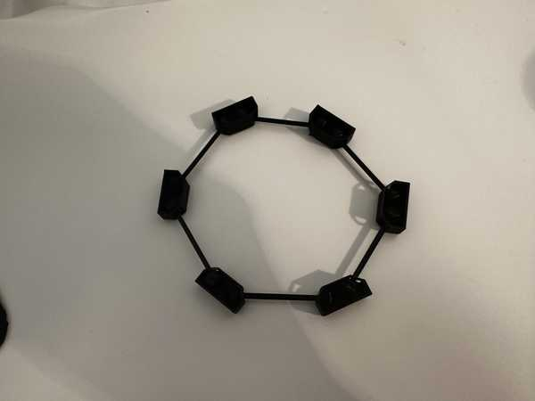
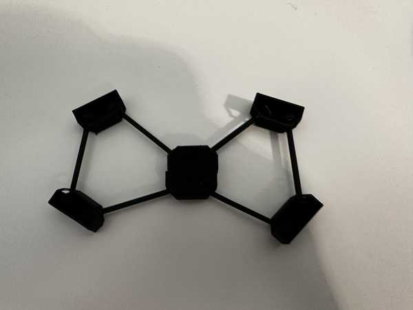

# 5. 3D Scanning and Printing

This week I worked on testing using a 3D printer and learning how to 3D scan objects.

You can find the files used this week [here](../files/Week05-Files.zip).

## 3D Printing

### Planning the Design

To fulfill the assignment of making a design that can't be made with subtractive manufacturing, I decided to make a design with multiple joints that cannot be pulled apart without breaking the design and has several different parts. 

When thinking of what I wanted to make, I originally had the idea of a basic ball and socket joint that could rotate a box around a spherical part. I then extended this idea to include multiple of these joints that are all linked together in a polygon shape. I ended up choosing for there to be 6 sides specifically.

### Designing in Fusion 360

I started by making a sketch on the horizontal plane with a regular hexagon so that I could model my parts off of it. Next, to one vertex of the hexagon, I added a rectangle that would hold two of the ball joints.

In order to create a shape for the openings of the ball joints, I created diagonals on two of the corners of the rectangle. I also created a -2mm offset (not relative to the actual print) for that border and add two circles inside of the rectangle to represent the spheres in the joint.

Once I was done sketching, I extruded the outer part of the box (the part between the offset outline and the original outline) and added a bottom and top face to it.

Next, I created the two slots for the openings of each of the joints by negatively extruding an offset rectangle onto the angled faces of the box.

To finish the joint template, I created two spheres based off of the circles I had drawn in my sketch. Once I had all of the components of the joint done, I used the **Circular Pattern** feature to duplicate it on each vertex of the hexagon.

To create the connectors for the joints, I started by extruding a pipe going between each adjacent sphere. I then duplicated it to connect each other adjacent sphere by using a circular pattern again (see image).

### Exporting and Slicing with PrusaSlicer

From Fusion 360, I exported my finished design as a **.STL** file. Once done exporting, I imported the STL file into PrusaSlicer.

I ensured that I selected my desired printer (Prusa Mini) and the correct filament, and I scaled the overall width of my design to roughly 70 mm. I selected for there to be supports everywhere because my design was very unstable, and I sliced the design.

After the design was fully sliced, I exported its GCode as a **.gcode** file.

### Printing with OctoPrint

My Fab Lab already had OctoPrint set up with our 3D printers, so I used that to upload the file. I logged onto one of the computers connected to my lab's network and opened the OctoPrint url for the printer that I wanted to use. I imported my file onto the printer, let it heat up, and sent the design for printing.

There were no problems during this process, and the print was able to come out successfully.

### Problem with Supports

When I tried to take off the supports in my design, I was not able to do so very easily. I realized that since I had both a bottom and top face for the joints, it would be very difficult to get out the supports from inside of the joint. I decided to abandon this print, since this would be unfeasable to do and have too much risk of breaking the design.

I tried fixing the design by simply removing the top face of each joint. This would allow for less supports on the inside (removed the ones supporting the top face) and easier access to remove the supports. I repeated the same process for getting the new design into OctoPrint, and I let the design print.

When the print finished, however, I saw that the part going over the joint holes was broken because it was too thin and didn't have any supports. The spheres also easily came out of their respective joint holes, which completely went against the purpose of my design.

### Final Working Design

I attempted to solve these problems by making the walls of the joints thicker and the spheres in the joints bigger. This would prevent anything breaking or coming out when it should not. 

After I did this and also made the connector pieces wider (so the design would not break easily), I tried 3D printing it again. I had to 3D print at my house, which had a slightly different process (since I had not set up OctoPrint). I uploaded my gcode file onto the USB that came with my printer, and I inserted the USB into my home printer. I then selected my design on the printer UI, and the print ran well.

<video width="640" height="480" muted controls><source src="../../videos/week05/Week05-Printing-FinalVideo.mp4" type="video/mp4"/>The video is not supported in your browser.</video>

None of the object broke while printing, which was a good sign. When it came to taking off supports, it was really hard at first, but it was not as hard as my first print. The supports at the openings of the joints were especially hard to get off due to the limited space to pull on them. Though it took a while, I was eventually able to get all of the supports off to finish my 3D printed object.

### Interesting Characteristics

All of the joints were able to move freely around, which caused them to form some interesting patterns that I had not thought of when designing the object. For example, when turning three of the joint pieces upside down, I created a star-like hexagon that was very stable (the shape was not able to be varied by simply moving it horizontally).

I also created a less stable bow-tie shape by turning two opposite joint pieces upside down.

The spheres could also move out of the top of their joints to allow for more variation in side lengths and patterns that could be made.

Overall, this design was a lot more fun to experiment with than I had originally thought.

## 3D Scanning

### Setup

For my object to scan, I wanted to scan a tape dispenser. I thought it would be interesting to see how the software could capture its shape and different aspects.

I used an app on my phone called [PolyCam](https://apps.apple.com/us/app/polycam-3d-scanner-lidar-360/id1532482376) to 3D scan the tape dispenser. Their website can be found [here](https://poly.cam/).

### Scanning

I used the LiDAR feature on PolyCam to scan my object, which detects light to measure the relative position and orientation of an object. I scanned it by slowly moving around it and showing as many perspectives as I could.

My first scan came out quite well, but the front of the tape dispenser was not able to be modeled fully.

I scanned a couple more times until I found a scan I liked and I uploaded that scan to the cloud.

[Here](https://poly.cam/capture/F3CA89CD-370F-4FC9-9DF4-F8CA8E88F6CE) is a link to my design that can be interacted with.

### Converting to OBJ

PolyCam only allowed me to export the file as a **.GLB** since I did not have a premium subscription, so I used [this online converter](https://products.aspose.app/3d/conversion/glb-to-obj) to convert it to my desired format: a **.OBJ** file.

I tried opening the converted file in Fusion 360, which was done successfully. However, the image projection that was done on PolyCam was not represented in the OBJ file, which instead had a solid color. Importing the design into Fusion also allowed me to see some more holes in my design and things that might have been able to be scanned better.

## Group Portion

I worked with Landon Broadwell this week, and our group documentation can be found [here](https://fabacademy.org/2024/labs/charlotte/assignments/week05b/).

The group portion of this week consisted of testing the design rules for my lab's 3D printers.

I contributed by printing an all-in-one test on our Prusa Mini printers. I obtained the design file online and kept the same dimensions since they were part of some of the tests.

I also documented how some of the tests, such as the overhang and hole test, came out on the Prusa Mini.

My group also used the Formlabs 3D Printer to print another overhang test (horizontal), but Landon did the majortiy of that part.

## Reflection

I enjoyed this week, and it felt a lot more relaxing than some of the previous weeks. I already had knowledge of how to 3D print and designing models, so there was not as much new material. I started the week by designing something that couldn't be made subtractively in Fusion 360, which I did by creating joint pieces that could not have been placed together after they were made and must have been manufactured that way. I had to go through multiple iterations of printing the design until all of the supports could come off well and it was sturdy enough not to break easily, but I eventually had a good final design. I also tried 3D scanning an object for the first time, which was really interesting to do. I never knew that photos taken from different perspectives could combine to form a semi-accurate 3D model of that object. I was also very surprised by the group portion since the Prusa Mini torture test passed all of the individual tests and had a solid structure.

## Credits

All credits are mentioned when they are used respectively.