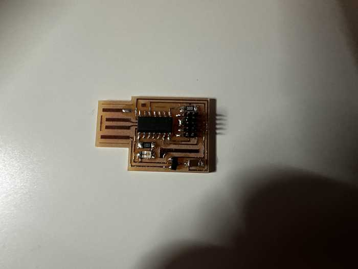

# 6. Embedded Programming

This week I worked on programming a previously designed microcontroller to perform certain tasks and communicate.

This week's files can be found [here](../files/Week06-Files.zip). Note that the majority of the files used are stored in [Week 4's files](../files/Week04-Files.zip) because I already programmed the Quentorres board that week.

## Programming Microcontroller to Interact with LEDs

To program the board, I downloaded the [Arduino IDE](https://www.arduino.cc/en/software) onto my computer.

Next, I plugged the XIAO RP2040 onto my computer using a USBC cable, and I reset the board by holding buttons R and B.

I unplugged it and plugged it in again, but for some reason, the board was not turning on despite it turning on earlier. I was told by Mr. Dubick that there might be a short in the part of the board where there should have been holes. I checked for conductivity between the points, and it was confirmed that there was one. To fix this, I used a razor blade to cut the copper between each circle, and the board worked well.


On the Arduino IDE, I made sure to install the RP2040 package in **File->Preferences->Additional Board Manager URLs** and set my current board to the *Seeed XIAO RP2040*. I also changed my port to the one that the chip was plugged into. First, I wrote some code to make the LEDs light up in an alternating pattern, disregarding the switch on the board.

Here is my code for that section:

```C
void setup() {
  //Sets up pins with LEDs for output
  pinMode(26, OUTPUT);
  pinMode(0, OUTPUT);
  pinMode(1, OUTPUT);
}

//Repeats code inside indefinitely
void loop() {
  //Turns each LED on, waits 100 milliseconds, turns it off, and turns on next one
  digitalWrite(26, HIGH);
  delay(100);
  digitalWrite(26, LOW);
  digitalWrite(0, HIGH);
  delay(100);
  digitalWrite(0, LOW);
  digitalWrite(1, HIGH);
  delay(100);
  digitalWrite(1, LOW);
}
```

I tested out the code, but for some reason, my 3rd LED was not working.

<video width="720" height="480" muted controls><source src="../../videos/week04/Week04-Programming-BrokenLight.mp4" type="video/mp4"/>The video is not supported in your browser.</video>

I realized that I had not soldered the corresponding pin of the RP2040 to the board, so I quickly did that. I tested it again, but the LED still did not work. I really quickly tried a conductivity test on both sides of the LED, and it did not go through at all. Since it was probably a bad LED, I replaced it and everything lit up fine.

<video width="720" height="480" muted controls><source src="../../videos/week04/Week04-Programming-ThreeLight.mp4" type="video/mp4"/>The video is not supported in your browser.</video>

Next, I modified my code to only turn on the LEDs when the tactile switch on the board is pressed. I looked up how to do it, and I found [this article](https://forum.arduino.cc/t/how-can-i-detect-button-pressing/1078252) suggesting that I use the digitalRead() function. 

Here is the code:

```C
void setup() {
  //Sets up pins with LEDs for output
  pinMode(26, OUTPUT);
  pinMode(0, OUTPUT);
  pinMode(1, OUTPUT);
  //Sets up pin with switch for input
  pinMode(27, INPUT);
}

//Repeats code inside indefinitely
void loop() {
  //Sets a boolean to check if the button is being pressed down
  bool buttonPressed = digitalRead(27);
  //Does the LED sequence if the button is pressed down
  if (buttonPressed) {
    pressedFunc();
  }
  //Turns off the LEDs when the button is not pressed
  else {
    digitalWrite(26, LOW);
    digitalWrite(0, LOW);
    digitalWrite(1, LOW);
  }
}

void pressedFunc() {
  //Turns each LED on, waits 100 milliseconds, turns it off, and turns on next one
  digitalWrite(26, HIGH);
  delay(100);
  digitalWrite(26, LOW);
  digitalWrite(0, HIGH);
  delay(100);
  digitalWrite(0, LOW);
  digitalWrite(1, HIGH);
  delay(100);
  digitalWrite(1, LOW);
}
```

**N.B. this file and the files with the previously shown code can be found in my Week 4 files.**

When testing out the code, the button worked successfully:

<video width="720" height="480" muted controls><source src="../../videos/week04/Week04-Programming-ButtonHold.mp4" type="video/mp4"/>The video is not supported in your browser.</video>

## Communication between Microcontroller and Computer

I was able to make the board display a message on the computer when the button on the microcontroller was pressed down.

When looking up how I could transmit a message to the computer, I figured out that I could use Serial, and I used [this reference](https://www.arduino.cc/reference/en/language/functions/communication/serial/) for help. Serial helps to administer communication between my microcontroller board and a computer, which is exactly what I was looking for.

To implement this, I first wrote in the setup() function: ```Serial.begin(9600);```

This function sets the data rate (how often information on the board is transmitted to the computer) to 9600 bauds, or bits/second.

I also used ```Serial.print({INSERT CSTRING HERE});``` whenever I needed to in the code to transmit a message to the Arduino **Serial Monitor**, which could be accessed through **Tools->Serial Monitor** or **Ctrl + M** on Windows.

I then designed the program to communicate with the board when the button was pressed, which was slightly different than the previous program I made but fairly similar:

```C

//Global variable definition
bool buttonState = 0;

//Allowing input from button and communication to Serial Monitor
void setup() {
  pinMode(27, INPUT);
  Serial.begin(9600);
}

void loop() {
  bool buttonPressed = digitalRead(27);
  if (buttonState != buttonPressed) { //Checks if the current set button state conflicts with if the button is being pressed
    //Sends a message saying the button has been pressed once it is initially pressed down
    if (buttonState == 0) {
      Serial.print("The button was pressed.");
    }
    buttonState = !buttonState; //Flips the value of buttonState
  }
}
```

Here is the working communication:

<video width="640" height="480" muted controls><source src="../../videos/week06/Week06-Quentorres-Serial.mp4" type="video/mp4"/>The video is not supported in your browser.</video>

## Making SAMD11C Board

Along with my group portion, I individually decided to mill a board implementing the SAMD11C chip for testing purposes. Since [Group A](https://fabacademy.org/2024/labs/charlotte/assignments/week06a/) had already found a board file for the SAMD11C, I decided to just use theirs. 

There were no problems while milling and stuffing this board.



To program the board, I used a binary called [edbg](https://github.com/ataradov/edbg). I downloaded the binary from the linked repository and connected the SAMD board to my computer using my Quentorres board from Week 4. I then ran the line ```edbg -ebpv -t samd11 -f sam_ba_SAMD11C14A.bin``` to allow me to program the SAMD board directly. Once I ensured that the upload verified, I then plugged the USB component of the SAMD board into my computer directly and uploaded a basic blink code to it (Since it is very similar to others I have done, I will not upload the file).

Here is a video of the board successfully blinking:

<video width="480" height="640" muted controls><source src="../../videos/week06/Week06-SAMD-Blink.mp4" type="video/mp4"/>The video is not supported in your browser.</video>

## Group Portion

In this week, I worked with Angelina Yang and Kabir Nawaz. You can find our documentation [here](https://fabacademy.org/2024/labs/charlotte/assignments/week06c/).

For the group portion this week, we had to examine the datasheet for our assigned microcontroller (ATTiny412). We also learned how to make a programmer board and made the ATTiny412 blink through that board.

### ATTiny412 Datasheet Contribution

I found an [online source](https://ww1.microchip.com/downloads/en/DeviceDoc/40001911A.pdf) to reference for the datasheet and compiled the most important properties of the ATTiny412 in a table. I also obtained a pinout of the ATTiiny from that site. I did the same thing with the SAMD11C chip using [this source](https://ww1.microchip.com/downloads/en/DeviceDoc/Atmel-42363-SAM-D11_Datasheet.pdf). After that, I compared the two chips and concluded that the SAMD11C has many more features, but the ATTiny412 is better for less complex designs.

### Making Programmer Board Contribution

I helped to find a board design file to hold the ATTiny412. At first, I used the [Quentorres site](https://gitlab.fabcloud.org/pub/programmers/quentorres) to find what general design I was looking for, and I eventually found a nice and simple board design [here](https://sheekgeek.org/2020/adamsheekgeek/attiny412-general-purpose-blinky-board-and-updi-programming). I needed to go to the [GitLab page](https://gitlab.fabcloud.org/acharris/updiblinky) for the design and downloaded the copper design file (newBlinky-F_Cu.gbr).

I also helped to mill the board. I uploaded the file into the Bantam Tools software and cut the board design using a 1/64" and 1/32" bit. There were no particular problems at this step.

I gathered and soldered a couple of the components on the ATTiny412 board, including the LED and the header pins.

In terms of programming, I followed [Teddy Warner's documentation](https://teddywarner.org/Projects/SerialUPDI/#jtag2updi-usage) on how to get jtag2updi to create a programmer board and upload code via that board.

My group struggled to get jtag to work at first, but we eventually got it to work with an Arduino. After using the Arduino, we also programmed our Quentorres boards to become a microcontroller programmer.

## Reflection

This week was a nice review of how to program with Arduino and it helped me to learn how to program a microcontroller development board. I started with the individual assignment, which used the Quentorres board from [week 4](https://fabacademy.org/2024/labs/charlotte/students/connor-cruz/#assignments/week04/). I programmed it to interact (both input and output) with outside components, being mainly a button and a couple of LEDs. Afterwards, I learned how to make a program for the board to communicate with the computer through Serial. The group portion was definitely the hardest part of this week. Although it was hard to find the design and figure out why uploading our programs to our chip would not work, I feel like I learned a lot about the general process of using a programmer board to send a program to a chip. I also programmed the SAMD11C chip using a different upload process, which helped me to find out new ways of programming chips. This was probably one of the harder weeks so far, but I feel like I learned many things from the mistakes made.

## Credits

All credits are mentioned where they are used respectively.