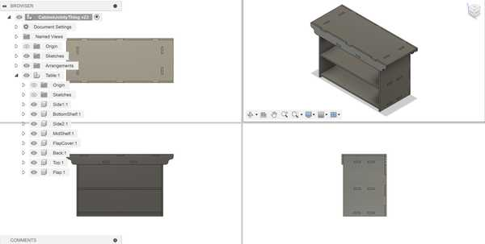
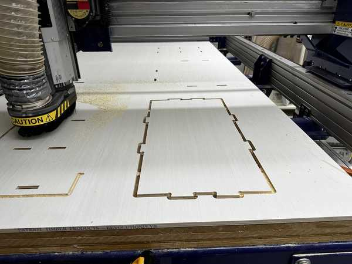
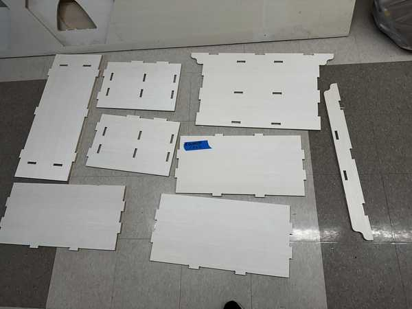

# 7. Computer Controlled Machining

This week I worked on using the large CNC machine to create a big object.

You can find the files used this week [here](../files/Week07-Files.zip).

## CAM Design in Fusion

I used Fusion to design my object because I could easily create a 3D model based on the sketches that I drew.

### Idea and Basic Render

I wanted to design a basic table that could also function as a shelf. I planned to add joints to the design and not use any adhesive or screws, so I first created a rough 3D model of the design without any of the joints to show points of overlap and how the table would generally fit together.

### Piece and Joint Planning

I planned to ultimately use two types of joints with my project: mortise and tenon joints and finger joints. I feel that mortise and tenon joints can provide a strong connection when on all sides, even without glue or screws. I will also use the finger joints primarily for the corners that I want to be flat (such as the back side corners).

### Designing in Fusion

I first created some parameters so that I could change the dimensions of anything in the design if I wanted to. Here is the list of parameters and their initial values (will be changed later).

I then created a sketch for each of the sides as I intended in my paper sketch. Once all of the sketches were finished, I extruded them as separate bodies from each other to see if there was any overlap or any joints that did not fit. I had quite a few inaccurately placed joints here because I forgot to account for wood with in a couple of my calculations. I fixed everything up until the 3D model looked good.

 Once I got everything done, I changed the values of the parameters and the model scaled successfully.

## Cam Toolpath with Aspire

### Exporting from Fusion

 To convert my Fusion file into a vector file, I first needed to find a way to flatten all of my extruded objects so that they could all be projected into a singular sketch. 
 
 Mr. Budzichowski recommended [his documentation](https://fabacademy.org/2023/labs/charlotte/students/zack-budzichowski/assignments/week07/) for this, in which he used the "Arrange" tool. This tool takes a set of components and flattens them all onto a 2D plane of a specific size.

 Once I got all of the objects flattened, I then created a new sketch on the same plane and projected those objects into the sketch. Finally, I exported a **.dxf** file containing the sketch lines.

 

### Importing into Aspire and Dog-Bones

In Vectric Aspire, I created a new document. I set its width to 4ft and length to 2ft and set no offset for the origin. I also wanted to cut with a Z Zero position at the machine bed. I then obtained my .dxf file fom earlier and imported it into Aspire. 

Next, I created dog-bone fillets at each corner where it was necessary. I originally planned to use the 3/8" tool in our lab for everythin0g in the design, but I realized that it would not fit fully inside of the mortise cutouts. Therefore, I used the 1/8" tool as well. My instructors stated that my dog-bone fillets should not be a smaller radius than that of the tool we used (need to divide the diameter by 2). To keep it safe, I made my fillets roughly 0.05-0.1 inches larger.

Here is the edited vector in Aspire:

### Generating CAM Toolpath for Mortises

Next, I needed to create the CAM toolpaths for each closed shape that I intended to cut.

I first wanted to create the toolpath for my mortises. I decided to make these pocket cuts since they were small and I did not want to secure them with tabs. I ensured that I set my tool to the 1/8" straight tool.

For this toolpath, even though I had a sacrificial layer, I set the cut depth to 0.45 in (the actual measurement of my selected peice of wood). I made 4 passes (as not to exceed the diameter of the tool for each pass) and set the direction of the cut to "Climb" because I wanted a slightly cleaner cut.

I pressed "Calculate" to generate the toolpath, and I reviewed the simulation of it running. There were no apparent problems in the simulation. (See these in next section)

### Cam Toolpath for Outlines

For my outlines, I needed to use a profile cut to cut only along the outlines.

I set the cut depth to 0.45 in for this cut as well, and I set my tool to the 3/8" compression spiral. I also only needed 2 passes for this, since each pass would only be approximately 0.225 inches, which is less than 3/8 of an inch.

I added four tabs to each outline so that the wood would not detach during the milling process. I also made sure to set the cut type to "Outline" since I wanted to keep my pieces constant with how I designed them in Fusion (and make the tenons large enough to fit in the mortises).

I calculated this toolpath as well, and I ran its simulation along with the pocket cut (I made the pocket cut first to avoid the wood moving while cutting them). Nothing went badly, so I exported my toolpaths as a single **.sbp** file for cutting, since I would be using a large ShopBot.

Here are both of the toolpaths:

Here is the finished simulation of the toolpaths:

## Using the ShopBot

Throughout the process of cutting, I followed [my lab's workflow](https://docs.google.com/document/d/13KMj7j8VIOVJ1x5KJyU1tCYY6a3ldDfN6Uc6bT5ok20) on how to use the ShopBot CNC Machine. Since someone had already used the machine before me on that day, I did not need to run the Start of Day routine (and the End of Day routine as well).

The machine also automatically changes its bit when necessary, so I did not need to manually install a bit.

<video width="640" height="360" muted controls><source src="../../videos/week07/Week07-CNC-BitChange.mp4" type="video/mp4"/>The video is not supported in your browser.</video>

### Fixturing the Wood

Before I could start, I wanted to secure my piece of wood to the bed of the machine. I used a brad gun to apply brad nails across the entirety of my board. I made sure to add them on the edges and where there was free space on the middle of the board. I did not add enough in the middle of the board, however, which would be found out later.

### Air Cut

I used the ShopBot software to control the CNC machine.

To initialize the air cut, I jogged the Z-Axis to 1 inch above my board (Z = 1.45) and set that as the new Z-Zero. This would allow me to run a test cut of my design and check if everything with the toolpath worked well. Before I did this, I applied the dust skirt to the bit in order to 

I loaded my file onto the ShopBot software, and I pressed the physical "START" button to begin spinning the bit. I then proceeded to run the cut. The cut did the pockets first, so I watched it simulate roughly 5 of them. Since nothing was unusual, I stopped the air cut and proceeded to the actual cut.

Height of the air cut above the material:

### Actual Cut

I used the C3 command to reset the Z-Zero and home the ShopBot. Next, I loaded my file once again, pressed the "START" button to spin the bit, and ran the cut. 

The pockets seemed to be cutting out very well on the first part of the cut, but when the tool got closer to the middle of the board, the pockets did not cut entirely fully. When I looked back at where I placed the brads, I realized that I probably should have placed another one in the middle of the board, so the wood was likely raised there because of that.

Video of a pocket cut:

<video width="640" height="360" muted controls><source src="../../videos/week07/Week07-CNC-PocketCut.mp4" type="video/mp4"/>The video is not supported in your browser.</video>

When it came time to change the bit, the bit was successfully changed, but the dust skirt fell off. I needed to stop the job in order to place it back on since the tool was too low. I jogged the tool up the Z-Axis and placed the skirt back on. Since this was already the end of the pocket cut, I decided to import a new SBP file with just the profile cuts into the ShopBot software since I could not resume the job once it was stopped.

The profile cuts had the same problem as the pocket cuts: they did not cut fully through at the middle of the board. I decided to simply let the job continue since trying to secure the middle would cause inconsistencies with joint placements.

One of the profile cuts:

Below is an image of the finished job:

Once the job was done, I used a multitool to remove the tabs and cut through the parts that were not fully cut through.

## Assembling the Shelf-Table

All of the wood pieces:

### Refining the Pieces

After being removed from the board, the pieces had frayed edges and still had some parts of the tabs remaining. To fix this, I first used the multitool to cut off all parts of the tabs. I also used a dremel to get rood of any excess wood on the edges.

### Joint Problem

When I tried testing if one of my pairs of joints would fit together, I noticed that the tenons were very slightly too big to fit. This was a very big problem since I had more than 20 of these joints in my entire design. Mr. Budzichowski gave the suggestion that I could sand down the edges of the tenons to make a ramp fit. This would allow me to partly push together the joints and use a mallet to join them together. However, this comes at the cost of not being able to take apart the joined pieces of wood.

At the suggestion of Dr. Taylor, I also used a piece of sandpaper attached to a multitool to sand the insides of the mortises. After a couple of hours sanding each piece and seeing if their respective joints could fit together, I was eventually ready to assemble my table.

### Assembly

I started by attaching the shelves and flap cover to the back cover of the shelf since that is the innermost part of the design. I pushed the shelves in as much as I could with my hands. Then, I obtained a mallet and a piece of hardwood. I placed the hardwood wherever I wanted to hit in order to ensure that my wood would not break due to the mallet's pressure.

The hardest part the assembly came once I fully inserted the shelves and flap cover into the back cover. I had to somehow fit the side pieces onto the shelves, which required fitting 3 separate pieces and 6 total joints. I also needed to deal with the finger joints at one edge of the side pieces.

I needed to slightly sand down the tenon connected to the middle shelf since it was not pushed in as far as the other pieces. This could have been due to a multitude of factors, but I suspect that I had accidentally left a small amount of the tabs on it.

I struggled trying to get all of the three shelf pieces to fit in the side piece at the same time. Dr. Taylor suggested that I instead slightly push the side piece into one of the shelves and do the same for each of the pieces. This would make it so that the side piece would not bend so much that part of it would be pushed out when further using the mallet.

Eventually, with enough trial-and-error, I was able to get the first side on. The second side followed a similar process, but it was slightly easier since the shelves were already mostly fixed in place.

I then added the front flap of my design, which was not too hard since I was only joining two separate pieces of wood with only two joints.

Adding the top piece was also quite hard since all of the slight imperfections made in my design beforehand caused a fairly significant offset in the joints. I decided to use two adjacent tenons as a reference for what parts I needed to sand. I only needed to sand some of the finger joints a very slight amount since the offset between the front flap and back cover was not too significant. However, the offset between the two sets of joints from the side covers was quite bad. I had to sand down the tenons (not used for reference) a fairly large amount, but they eventually fit into their designated mortises.

I used the same process as I did for the sides to insert the two separate joint pairs together.

Once the top cover was placed, my entire table was finished!

<video width="640" height="360" muted controls><source src="../../videos/week07/Week07-Assembly-Final.mp4" type="video/mp4"/>The video is not supported in your browser.</video>

The table was also very strong since there was little to no extra space between the mortises and tenons after using the mallet to push them together.

## Group Portion

In this week, I worked with Angelina Yang and Kabir Nawaz. Our documentation can be found [here](https://fabacademy.org/2024/labs/charlotte/assignments/week07c/).

Our group assignment this week was primarily to test various factors for our lab's CNC machine.

I helped to test the different tools in the lab and some of the different fixturing methods. Everyone in the group also contributed to testing runout.

## Reflection

This week was probably the hardest week of Fab Academy so far. The entire process of designing something that should be able to be held together with joints alone (no glue or screws), converting it to a CAM toolpath, cutting the toolpath, and sanding down every one of my joints took a large amount of time and was very tedious to do. From this, however, I was able to learn some things to be very aware of when using the CNC machine. When using this machine in the future, I need to account better for the tolerance of the machine by adding a larger offset between the mortises and tenons than I previously had. Also, even if there is not much space to do it, I should try my best to add brads (or whatever fixturing tools) to large areas in my material where there are not any others. Overall, I made quite a few mistakes this week that I will take to heart whenever using my lab's ShopBot or any other large CNC machine.

## Credits

Thanks to Mr. Budzichowski and Dr. Taylor for giving suggestions and helping me figure out how to assemble my table. All other credits are mentioned where they are used respectively.