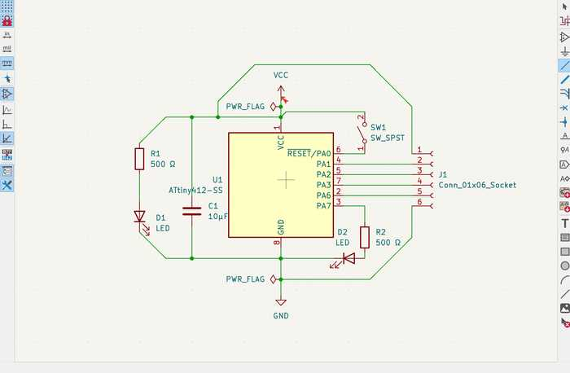
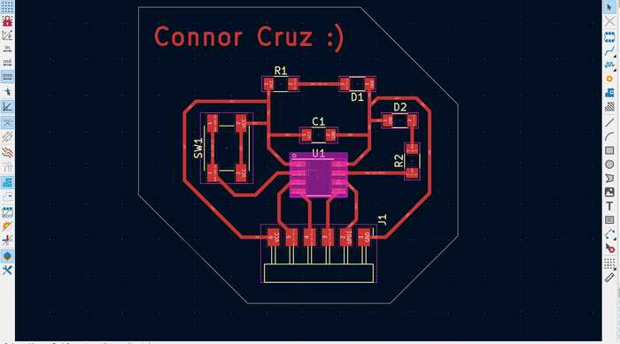
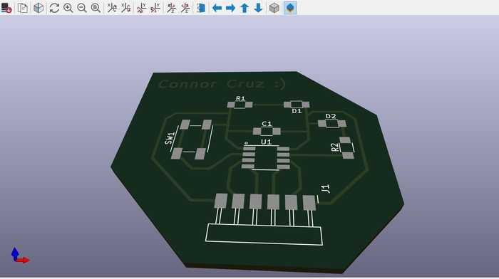
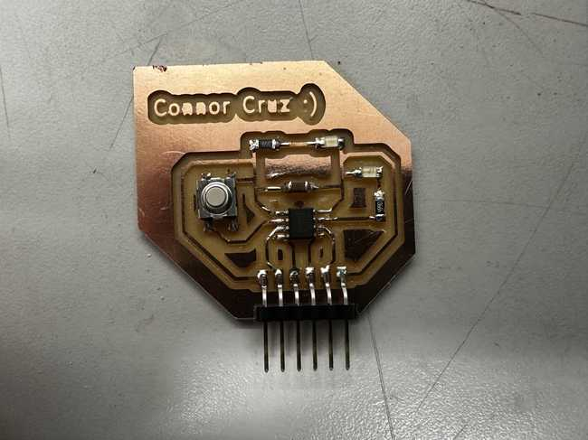

# 8. Electronics Design

This week I worked on designing my own circuit board and learning PCB design software.

You can find the files used this week [here](../files/Week08-Files.zip).

## Personal PCB Board Design in Kicad

I chose Kicad as the EDA software to make my circuit board and used [this tutorial](https://www.youtube.com/playlist?list=PLn6004q9oeqGl91KifK6xHGuqvXGb374G) as reference.

Before I started, I needed to import the (Fab Library)[https://gitlab.fabcloud.org/pub/libraries/electronics/kicad] into Kicad.

### PCB Desired Components

For the microcontroller for my PCB, I chose the ATTiny412. In my PCB, I wanted to have a decoupling capacitor between power and ground, an LED that is always on when power is supplied to the board, a programmable LED, an UPDI pin, and 3 pins for connecting either an input or output to the board.

### Schematic

It was fairly easy to design the schematic for my board since I already had a rough idea of how the components would connect. I started by adding my desired components and positioned them so that they could connect well, and I connected them respectively. 

Once done with the design, I ran an ERC (electrical rules checker) check, and I received two errors saying the same thing: **Input Power pin not driven by any Output Power pins**

I fixed these errors by adding power flags at the VCC and GND indicators to show that they are a source of power. I ran the ERC again, and there were no more errors.

### Footprint Assignment

For each of my components, I needed to assign a footprint to represent its actual shape and the location of each of its wires. Since my lab's components are primarily based off of those in the Fab library, I was able to find all of these components in both my lab and in the footprints provided by the Fab library.

### PCB Design Layout

After assigning the footprints, I used the PCB board editor to place the components in their real-world positions. I obtained all of the components by using the *Update PCB with changes made to schematic* tool (on the upper tool bar), which also showed the designated connections between the components.

Positioning each component was slightly difficult because the layout of the ATTiny412 was not the same as in the schematic. To prevent overlapping traces as much as possible, I changed connections in the schematic with regard to the actual layout of the ATTiny.

I added traces in tandem with positioning the components, which took a while due to having to change the positions of the traces and aligning the components to others to make the design neater.

Once I finished the board, I went to the Edge.Cuts layer and drew and outline for the board.

To check if everything was connected well, I used the DRC (design rules checker). I found that there were a couple of unconnected traces that I had forgotten to delete, so I removed them. There were also 12 warnings showing that the silkscreen of the header pins was clipped by the solder mask. Since this doesn't matter much when actually milling the board, I decided to disregard the warnings.

To make sure that my board looked good overall, I used the *Show 3D viewer window* tool to visualize the actual 3D board. There were no apparent problems, so I considered my design to be finished.

## Physical Board

### Exporting and Milling the Board

To export my design file as a **.gbr** to use in the milling machine software, I pressed **File -> Fabrication Outputs -> Gerbers**. Since this circuit only has front side traces, I unchecked every layer except the copper mask and the edge cuts. I then pressed the **Plot** button and obtained the files from the shown directory.

I followed the same process for milling these files as in Week 4.

Some problems encountered while milling were that the piece of copper that I was milling was raised in some places. This caused some traces to not cut fully, and this happened on two separate attempts to make the board. One of the attempts ended up being functional by using a blade to cut the excess copper, but I decided that I would not use it since it may accidentally connect and cause a short.

Eventually, I got a board that I liked so I proceeded to stuff that one.

### Stuffing the Board

I used my file in the Kicad PCB editor as reference while stuffing the board. Since all of the components used in my design were Fab components, I was easily able to find them in my lab and add them to my board. Soldering the capacitor was slightly hard, but other than that, I had no major problems soldering.

### Testing and Programming

I tested the board by plugging it into my Quentorres board from Week 4. I saw that the power LED was on, so I knew that power was successfully transferred to the board.

To program my chip, I used the header pins on my ATTiny board to connect the power pins, ground pins, and UPDI pins (designated pin 6 on both). I used jtag2updi to make the Arduino Uno a programmer and programmed the LED at pin 7 of the ATTiny to blink using it. I used the same code as the Quentorres with the pin changed (but you can find the changed file in Week 8 Files). I originally had an error in uploading the code to my ATTiny, but I realized that I had selected the wrong pin (since pin 7 shown on the ATTiny actually corresponded to pin 4). I tried uploading again, and it worked with no problems.

<video width="640" height="480" muted controls><source src="../../videos/week08/Week08-PhysPCB-Blink.mp4" type="video/mp4"/>The video is not supported in your browser.</video>

I also wanted to test if the button on my board worked. To do this, I set pin 0 as an input pin and turned on the programmable LED on my board when the button was pressed down. Once again, I did the exact same thing for the Quentorres board, so I used the same code with some pins changed. This upload was immediately successful since I had everything set up already from the blink code.

<video width="640" height="480" muted controls><source src="../../videos/week08/Week08-PhysPCB-Button.mp4" type="video/mp4"/>The video is not supported in your browser.</video>

## Group Portion

In this week, I worked with Angelina Yang and Kabir Nawaz. You can find our group documentation [here](https://fabacademy.org/2024/labs/charlotte/assignments/week08c/).

Our task this week was to observe the operation of a microcontroller circuit board. To do this, we used a multimeter and an oscillator to measure voltage, current, and other aspects.

All of the group members were involved in most of the steps for using these tools. I mainly used the multimeter to measure the voltage supplied to an ATTiny chip and the amount of current running through it. I also measured the voltage drop of an analog LED that gradually got brighter and dimmer.

## Reflection

I thought that this week was not too hard, but it was really useful to learn. I learned the basics of circuit design using Kicad and designed my own PCB with it. I feel like while designing the schematic, I solidified my understanding of how circuitry works and was able to apply my knowledge as well. I was slightly confused on how some of the footprints connected, but I eventually figured it out. This week will also likely be useful for the Output and Input weeks since I left 3 pins connecting to the board for whatever use I needed. The board I made might also be used for my final project.

## Credits

All credits are mentioned where they are used respectively.