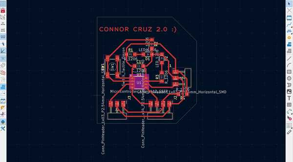
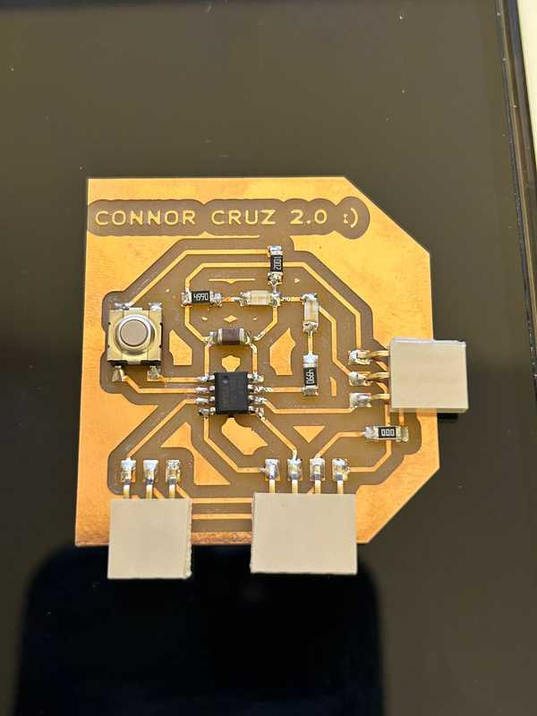

# 9. Output Devices

This week I worked on programming outputs that I plan to use in my final project (an OLED screen and a speaker).

You can find the files used this week [here](../files/Week09-Files.zip).

## New Board Design

When deciding which outputs to use, I realized that I only had one pin going out of my board for power and ground. Since I needed to provide power and connect ground to my output device, I made a new board with more power and ground ports. Because I also needed to use I2C, I paired the power and ground with the respective ports for SDA and SCL for the ATTiny412 to provide convenience when connecting an output device.

My schematic and design were mostly derived from my previous board, but it looked quite different.




There were also no problems while milling and stuffing the board, as well as programming it to do the same things as last week.


<video width="640" height="480" muted controls><source src="../../videos/week09/Week09-CC2-MaleButton.mp4" type="video/mp4"/>The video is not supported in your browser.</video>

Once I had finally finished my board, I accidentally broke one of the male headers off, causing 3 pads to rip off with it. I decided that this would be very hard to fix and I wanted my board to have some longevity, so I remilled a new board but instead of male headers, I used female headers.

Once again, there were no substantial problems, so I finished up the board and used it for my outputs.



<video width="640" height="480" muted controls><source src="../../videos/week09/Week09-CC2-FemaleButton.mp4" type="video/mp4"/>The video is not supported in your browser.</video>

## Programming an OLED Screen

### OLED Component and Board Used

I wanted to program an OLED screen since I plan to ultimately use a larger one with color for my final project.

I checked the components in my lab, and I decided to use a 128x64 SSD1306 OLED screen. I also wanted to make use of my new **Connor Cruz 2.0 :)** board because I had specifically configured it to easily access outputs. The board uses an ATTiny412, so I had to keep in mind the memory that the uploaded program used.

### Programming Screen with Arduino Uno

I started by trying to program my OLED screen using an Arduino Uno since I had easy access to them and it has a large amount of Flash memory. I was able to find a [very useful website](https://arduinogetstarted.com/tutorials/arduino-oled) that specified how to use the [Adafruit_SSD1306 library](https://www.arduino.cc/reference/en/libraries/adafruit-ssd1306/) to program the OLED. I tried out the sample code on the website:

```C
#include <Wire.h>
#include <Adafruit_GFX.h>
#include <Adafruit_SSD1306.h>

#define SCREEN_WIDTH 128 // OLED display width,  in pixels
#define SCREEN_HEIGHT 64 // OLED display height, in pixels

// declare an SSD1306 display object connected to I2C
Adafruit_SSD1306 oled(SCREEN_WIDTH, SCREEN_HEIGHT, &Wire, -1);

void setup() {
  Serial.begin(9600);

  // initialize OLED display with address 0x3C for 128x64
  if (!oled.begin(SSD1306_SWITCHCAPVCC, 0x3C)) {
    Serial.println(F("SSD1306 allocation failed"));
    while (true);
  }

  delay(2000);         // wait for initializing
  oled.clearDisplay(); // clear display

  oled.setTextSize(1);          // text size
  oled.setTextColor(WHITE);     // text color
  oled.setCursor(0, 10);        // position to display
  oled.println("Hell World!"); // text to display
  oled.display();               // show on OLED
}
```

N.B. The OLED screen has an SCL and SDA port since it features I2C, so I needed to plug them into their respective ports (also labeled SCL and SDA).

The upload was successful and the OLED screen was able to show the text.


The website also had a basic explanation of what each of these functions and object definitions did, so I had a better idea of how to use the Adafruit_SSD1306 library.

### Programming OLED with ATTiny412 (Connor Cruz 2.0 :) )

It was very hard to upload code to the OLED screen using the ATTiny412, mostly due to its limited 4KB of Flash memory.

When I tried to verify the code, I received this error (shortened due to length):

```Powershell
c:/.../avr/bin/ld.exe: address 0x3210 of C:\...\arduino_build_497981/Regular-SSD1306.ino.elf section '.text' is not within region 'text'

c:/.../avr/bin/ld.exe: C:\...\arduino_build_497981/Regular-SSD1306.ino.elf section '.rodata' will not fit in region 'text'

c:/.../avr/bin/ld.exe: address 0x3210 of C:\...\arduino_build_497981/Regular-SSD1306.ino.elf section '.text' is not within region 'text'

c:/.../avr/bin/ld.exe: region 'text' overflowed by 8854 bytes

etc.
```

I'm fairly confident that this error was caused due to the memory used by the program exceeding the memory limit of the ATTiny412 (since there is an overflow error of 8854 bytes). I tried removing all parts of the code except the include statements and the definition of the oled object, but the program still took up too much memory.

I tried to do the same with the [U8g2 library](https://www.arduino.cc/reference/en/libraries/u8g2/) and also tried to use *TinyWireM* rather than *Wire* in my code, but it only slightly reduced the amount of memory used.

After quite a lot of searching, I was able to find the [SSD1306Ascii library](https://www.arduino.cc/reference/en/libraries/ssd1306ascii/), which is able to program an SSD1306 screen but can only output text. I felt that this compromise was alright since I had already figured out how to use the SSD1306 library and wanted to learn how to reduce the memory as well.

From the SSD1306Ascii library, I first tried verifying the Wire128x64 example file since that would provide a basis for me to program the OLED screen using the ATTiny412. It verified but took up 90% of the Flash memory, so I was slightly limited on what I could actually include in my code.

I connected the OLED screen to the power, ground, SCL (PA2), and SDA (PA1) of my **Connor Cruz 2.0 :)** board and uploaded the code, producing the intended result:


Once I confirmed that the upload was done, I analyzed several of the examples from the SSD1306Ascii library and wrote some code to display some basic custom text on the screen. I wanted it to output the first couple of lines of the Aeneid, a Latin poem written by Virgil. Here is the program:

```C
#include <Wire.h>
#include "SSD1306Ascii.h"
#include "SSD1306AsciiWire.h"

#define I2C_ADDRESS 0x3C

SSD1306AsciiWire oled;

void setup() {
  Wire.begin();
  Wire.setClock(400000L);
  oled.begin(&Adafruit128x64, I2C_ADDRESS);

  oled.setFont(Callibri11); 
}

void loop() {
  delay(2000);
  oled.clear();
   oled.set2X();
  oled.println("The Aeneid");
  oled.set1X();
  delay(2000);
  oled.clear();
  oled.println("Arma virumque cano");
  oled.println("Troiae qui primus");
  oled.println("ab oris");
  delay(2000);
  oled.clear();
  oled.println("Italiam fato");
  oled.println("profugus Laviniaque");
  oled.println("venit");
  delay(2000);
  oled.clear();
  oled.println("vi superum saevae");
  oled.println("memorem Iunonis");
  oled.println("ob iram");
}
```

This program used 4050B out of 4096B of Flash memory, which was really close to all of it. I had tried to make the program more efficient by storing each of the lines in a 3-dimensional character array (since I did not want to import C++ string) and using a for loop, but that actually exceeded the Flash memory by about 500B.

Overall, I decided to simply keep my program the same and uploaded it to my Connor Cruz 2.0 board, which produced this:

<video width="640" height="480" muted controls><source src="../../videos/week09/Week09-OLED-Aeneid.mp4" type="video/mp4"/>The video is not supported in your browser.</video>

## Group Portion

In this week, I worked with Landon Broadwell. You can find our documentation [here](https://fabacademy.org/2024/labs/charlotte/assignments/week09b/).

Our assignment this week was to find the power consumed by an output device. Since both of us used an OLED screen in our individual assignment, we used this for the group assignment as well.

We both contributed to all of the steps in finding the power consumption (measuring the voltage and current), since it was a fairly short process. We used my OLED screen to measure this because it was more convenient at that time.

## Reflection

This week was really helpful to help advance in ideas for my final project. I worked with programming a small OLED screen using several libraries and controller boards. I had chosen an OLED screen (since I wanted to use a similar display on my final project), and I feel like I could now implement the same on a larger scale for my project. The only significantly hard part of this week was attempting to fit a program for the OLED screen on an ATTiny412. This was particularly challenging because many of the commonly used libraries (e.g. Adafruit_SSD1306 and U8g2) still took up too much memory on the chip. I eventually settled for a text-only library: SSD1306_Ascii. The group work was also nice to gauge the power consumption of the OLED screen for future reference.

## Credits

I troubleshooted quite a bit with [Landon Broadwell](https://fabacademy.org/2024/labs/charlotte/students/landon-broadwell/) this week since we both attempted to program the OLED screen with several different libraries, so credit to him for his help throughout the process. All other credits are mentioned where they are used respectively.