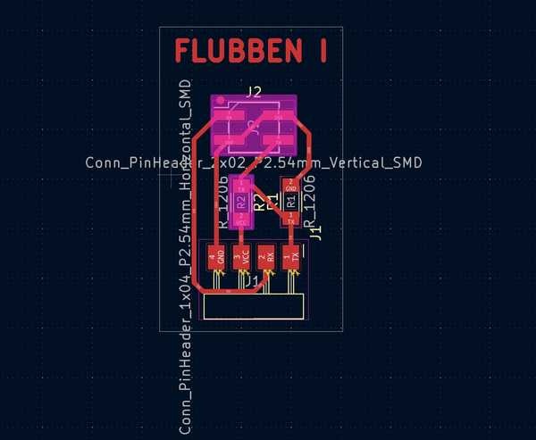

# 11. Input Devices

This week I worked on designing and programming sensors for my final project.

You can find the files used this week [here](../files/Week11-Files.zip).

## Sensor Ideas

For my final project, I needed sensors under an opaque acrylic layer that could tell when a piece was placed on top of them.

Before this week, I had intended to use hall effect sensors to achieve this effect. I thought of placing a magnet in the piece that would be placed.

I was slightly confused where to start, so I attended Global Open Time. The instructors there recommended a couple of possible sensors I could use:

- Hall effect magnetic sensor
- Capacitive touch sensor
- Time of flight
- Step response

Since I planned for my acrylic not to have any gaps for the sensors, time of flight would not work very well. However, step response seemed to fit very well since it can sense distance, even if there is an object intercepting it. Therefore, I chose to make and program a step response sensor this week.

## Step Response

### Circuit Design, Milling, and Stuffing

I primarily used [Neil's examples](https://academy.cba.mit.edu/classes/input_devices/index.html) for this week to learn how step response works. I chose to use the TX-RX model.

First, I made a connector piece for my [Connor Cruz 2.0 board](../assignments/week09.md). That board was perfect to use for this since I could use the SDA and SCL pins for TX and RX.

The design process was fairly easy, as I primarily based my design off the examples and the diagram in Neil's lecture. The TX pin was connected to 5V and GND via 1M resistors, as well as being connected to  and the RX pin would be connected to an electr. This board was deemed: **Flubben I**.




The milling and stuffing process also went well.


### Electrodes

For my electrodes, since I only planned on doing a temporary design for now, I used spare copper boards for PCB milling. I then attached jumper wires to each of these so that they could be connected to the Flubben I.


## Old Programming

I first created a function to digitally output HIGH and LOW to the TX pin every millisecond. I then stored the analog input of the RX pin after both the HIGH and LOW outputs.

I then set this process to iterate 100 times. For each iteration, I obtained the difference between the high and low readings, and I added it to a sum variable. After all 100 samples were done, I divided by the sample size to obtain an average difference. This would mostly cancel any possible noise.

I placed a book (Godel's Incompleteness Theorems) on the two electrodes, and I used trial and error to see the average values that would result from an object being directly above the book. I then set an LED to go on whenever this was sensed and turn off when it was not. When testing, it was somewhat able to work. Here is a video of the process:

<video width="640" height="480" muted controls><source src="../../videos/week11/Week11-StepResp-Hand.mp4" type="video/mp4"/>The video is not supported in your browser.</video>

Since the LED kept turning on and off, I decided to make the LED turning on more generalized. I set up a counter variable. I added 1 when the LED should be on and subtracted 1 when the LED should be off. Here was the result using a Green Lantern rubber duck:

<video width="640" height="480" muted controls><source src="../../videos/week11/Week11-StepResp-Ducky.mp4" type="video/mp4"/>The video is not supported in your browser.</video>

I'm not sure why this worked, but in the next section, I was able to fix this and get more consistent results.

## Fixing The Code and Sensor

I used a new book for the sensors since I did not have Godel's Incompleteness Theorems at the time of fixing. I instead used *Cicero In Catilinam I & II*.

I first decided not to divide the average by the amount of samples since that would make my ranges less precise. Since I wanted to sense specifically when something was touching or close to touching the book, I wanted the range to be fairly specific.

When looking back at Neil's example step-response sensors, I realized that the Grounds were not actually connected to the copper plates (the wires were cut off). Once I disconnected the grounds from both the Flubben I and the electrodes, the sensor worked very well.

Cicero Choking Sensor (LED turns off when hand is placed on the face):

<video width="640" height="360" muted controls><source src="../../videos/week11/Week11-StepResp-Cicero.mp4" type="video/mp4"/>The video is not supported in your browser.</video>

For the group project, I also decided to make the sensor set the brightness of an LED depending on how far a hand is away from the book. I first obtained a general range of analog sensor inputs I wanted to map to the LED, and I used a map function to assing them to 0-255 (brightness of the LED). There was a little bit of noise when sensing, but it was overall quite decent.

Oscilloscope Detecting Analog LED:

<center>
<video width="360" height="640" muted controls><source src="../../videos/week11/Week11-StepResp-AnalogLED.mp4" type="video/mp4"/>The video is not supported in your browser.</video>
</center>

## Working Code

```C
#define rxpin 3
#define txpin 2
#define settle 100
#define samples 100

void setup() {
  pinMode(txpin, OUTPUT);
  pinMode(4, OUTPUT);
}

long int average() {
  long int up, down, avg;
   avg = 0;
   noInterrupts();
   for (int i = 0; i < samples; i++) {
      digitalWrite(txpin, HIGH);
      up = analogRead(rxpin);
      delayMicroseconds(settle);
      digitalWrite(txpin, LOW);
      down = analogRead(rxpin);
      delayMicroseconds(settle);
      avg += up - down;
   }
   interrupts();
   return avg;
}

void betterEst() {
  int counter = 0;
  for (int i = 0; i < 10; i++) {
    long int avg = average();
    if (avg > 15000) counter++;
    else counter--;
  }
  if (counter >= -5) digitalWrite(4, HIGH);
  else digitalWrite(4, LOW);
}

void instantCheck() {
  long int avg = average();
  if (avg > 9000) digitalWrite(4, HIGH);
  else digitalWrite(4, LOW);
}
void analogLED() {
  long int avg = average();
  int newAvg = map(avg, 10000, 15000, 0, 255);
  analogWrite(4, 255 - newAvg);
}

void loop() {
  //Uncomment one function depending on which test you want to run.

   //instantCheck();
   betterEst();
   //analogLED();
}
```

I was quite happy with these results, and I'm glad that I was able to fix the sensor to have very consistent inputs.

## Group Portion

I worked with Richard Shan this week. Our documentation can be found [here](https://fabacademy.org/2024/labs/charlotte/assignments/week11a/).

The assignment this week was to probe the analog and digital signals of a sensor.

We were both involved in most of the aspects of this group project. Since Richard's sensor was essentially digital (a camera to detect faces), and mine was analog, we decided to test out both sensors with the oscilloscope.

I mainly worked on the step response reading and configuring and LED to match its inputs, while Richard worked on getting digital outputs from the camera. We both used the oscilloscope to obtain readings from the other's sensor.

## Conclusion

I was really confused about this week and how step response sensors worked at first, but with a couple of hours of rewatching Neil's lecture, looking at the examples, and analyzing diagrams, I was able to successfully make the sensor work partly. Eventually, after further debugging, I was able to make it work perfectly. The only problem was that it couldn't sense when objects were placed on the book and stayed there. I think that this week was very conducive to my final project since I now have one of the primary aspects done. I also have a newfound appreciation for step-response sensors, considering that they only need two electrodes, two resistors, and a microcontroller to function properly.

## Credits

Thanks to Mr. Durrett for helping me understand the logic behind step response better. All other credits are mentioned where they are used respectively.