# 12. Molding and Casting

This week I learned how to make molds and used different machines in the lab to create them.

## 2-Step Mold CAD and CAM

I used Fusion to design my mold, as well as create the toolpath for it to be milled.

To start, I wanted to make a 2-step mold. This would allow me to cast soft material (since the mold would be hard).

### Designing the Mold

I wanted to make a basic design of the mask worn by [the Knight](https://hollowknight.fandom.com/wiki/Knight) in the video game *Hollow Knight*.

To start the design, I obtained an image from the internet, traced it in a sketch, and extruded that sketch to create the mask. I also added some fillets to make the design smoother. Next, I created a rectangular prism for the actual mold, and I cut out the intersection between it and the mask (using the Combine tool in Fusion).

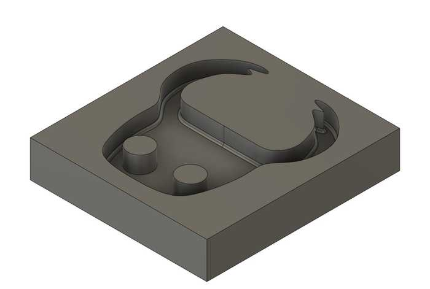

### Printing the Mold (Prusa Mini)

At this point, I exported the design as an STL file and converted it to gcode for the Prusa Mini printer through PrusaSlicer. I sent the gcode to the printer, and there were no problems along the way.

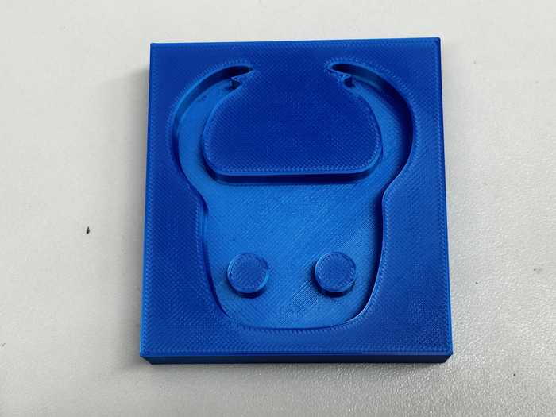

### Creating Toolpath

I also wanted to attempt to use my lab's milling machines to create a mold.

I used the **Manufacture** workspace in Fusion to create the CAM toolpath. First, I defined a new setup and set the machine to a generic Autodesk 3-axis. I configured settings for the positions of the axes and origin.For the stock, since I wanted it to be approximately the same size as my designed mold, I used a relative size box with no offset from the mold box.

Once the setup was configured, I made two toolpaths: one for a roughing pass and one for a finishing pass.

For the roughing pass, I used a 3D adaptive clearing since my design has some rounded parts. I set the tool to a 1/8" flat end mill (since it can easily remove a lot of material), and I set the maximum stepdown to 1 mm. I initially had an error that set that the toolpath was empty, but I fixed this when I realized that the stock went along the inside of the molding shape.

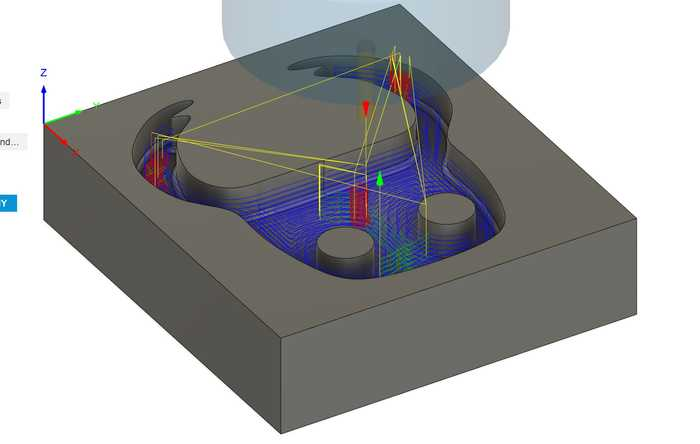

Next, I used a 3D contour path for the side finishing path and a 3D flat path for the bottom finishing path. I used a 1/16" flat end mill tool, and I set the maximum roughing stepdown to 0.75 mm. These toolpaths did not take long to generate at all, and they had a very short run time (roughly 10 minutes combined).

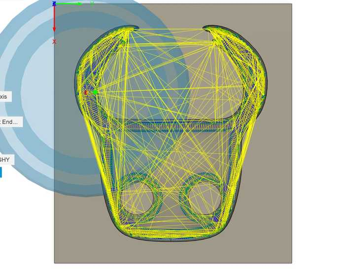

### Exporting Toolpaths and Milling

I used the *NC Program* tool in Fusion to export the toolpaths. I ensured that I set the machine to the Bantam Tools machine (since that was the one our lab had), named the files, and exported them as **.gcode** files.

I planned on using my lab's milling machines to mill the design out of wax.

I imported the toolpaths into the Bantam Tools software, and I milled them similarly to circuit boards from previous weeks. The only slight difference was that since the wax isn't conductive, I needed to measure the height manually with calipers.

The milling process went smoothly.

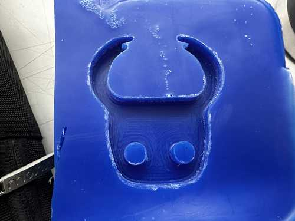

## 3-Step Mold CAD and CAM

My instructor, Mr. Dubick, also wanted us to make a 3-step mold for this week. This would allow us to make a hard final cast (since the mold and cast should be opposites).

### Designing the Mold

I first made a rectangular prism for the bottom of the mold. Next, I added the mask design to the top of it. Finally, I added sides to the mold that went higher than the mask in order to create a bottom part for the mold that would be casted from this mold.

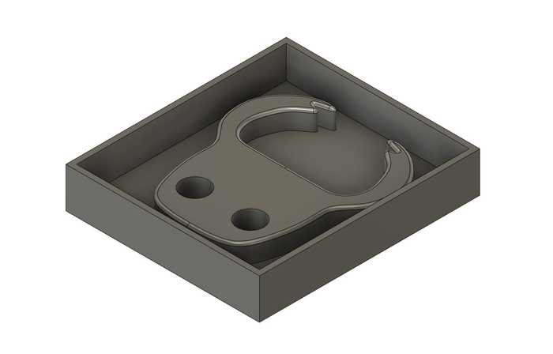

I planned to use my lab's resin printer to print this as part of this week's group project.

### Printing the Mold

I exported the .stl file for the 3 part mold from Fusion and followed a fairly similar process to the Prusa Minis to generate gcode for the Learned Fish Formlabs resin printer (using a different slicer).

The printing process went somewhat well, but even after curing for a fair bit of time, the print was still slightly sticky. Also, the supports did not come out very nicely, so there were quite a few small support pieces still attached.

Here is a picture of the mold (along with its soft cast):

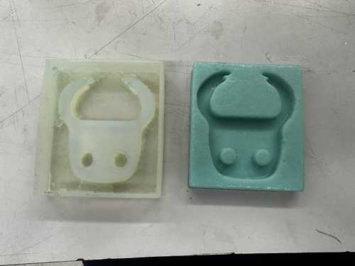

## Casting a Soft Piece

I used the mold printed by the Prusa Mini 3D printer for casting due to time constraints. When deciding which material I wanted to use for casting, I chose Smooth-On's [Mold Star](https://www.smooth-on.com/product-line/mold-star/) 15 Slow.

To figure out the approximate volume of my mold for apportioning how much silicone I would need to fill it, I used the Fusion model. I right clicked on the mask model and checked its properties, and it stated that the volume of the mask was 0.77 in^3. I converted this to mL to get roughly 12.6 mL.

Collin Kanofsky was also working on casting at the same time as me, so we collaborated throughout this process.

I obtained the containers with Part A and Part B of Mold Star, and we mixed them well. For Mold Star, parts a and B have a 1:1 ratio, so to get how much of each part I needed, I just divided 12.6 by 2, getting approximately 6.3 mL of each part.

After also accounting for Collin's necessary volume, we poured our combined amounts of Part A and B into two separate cups. Once our measurements for each part were correct, we poured the two parts together and stirred for some time.

While this was happening, I also sprayed some mold release into my mold to allow for easy removal.

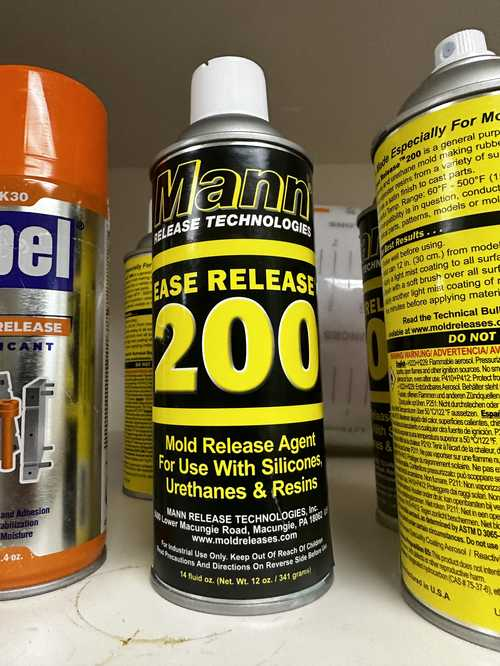

I poured the silicone mixture into my mold, and I made it so that it slightly overflowed (so the bottom of my cast could be even).

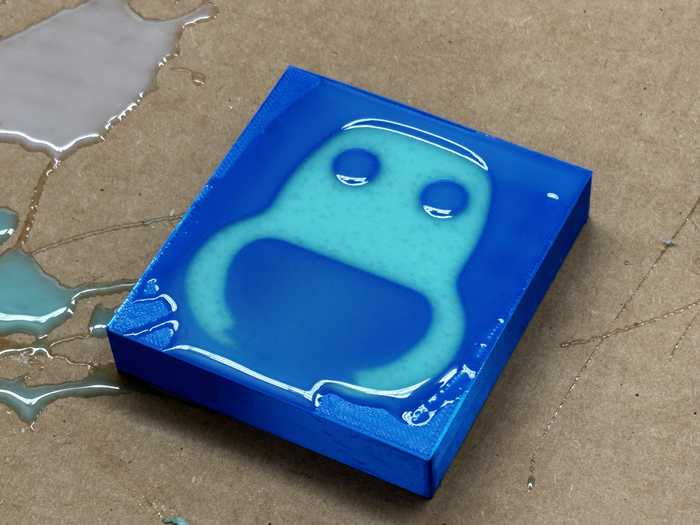

I then waited for the silicone to harden.

Once hardened, I was able to take out the mold using a scraper tool. Since there was some overflow in the mold, there was some excess silicone that I needed to cut off.

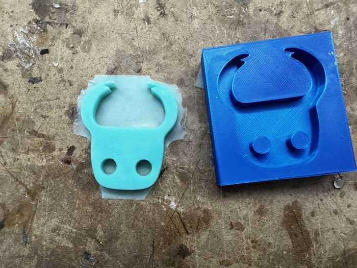

Here is the cast after cutting excess off:

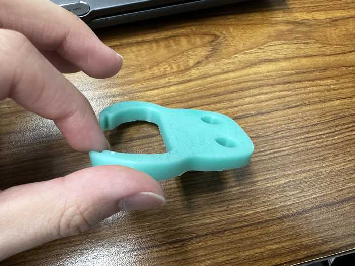

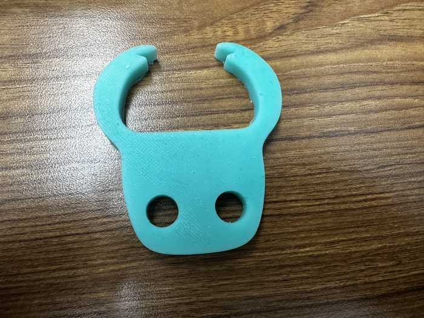

We also had some excess silicone, so for fun, Collin and I made a smiley face.

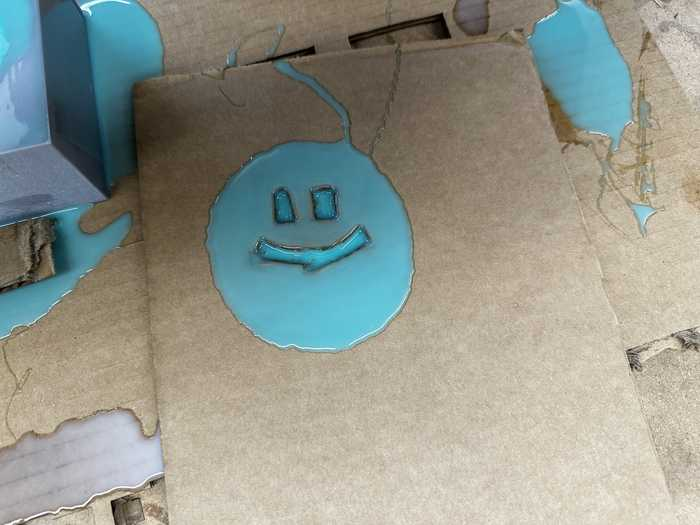

## Casting a Hard Piece

### Soft Mold from Resin-Printed Part

I used the 3-part mold from the resin printer to create a hard mold. Since a hard cast cannot be made from a hard mold (because it would not be able to be removed), I needed to essentially cast a soft version of the 3D printed mold.

I first cast the soft mold using Mold Star 15 Slow from the 3-part mold. Despite applying mold release, the soft mold did not come out well. It left some residue on the inside of the 3-part mold, and it seemed not to cure properly.

Here is a picture of the soft mold:

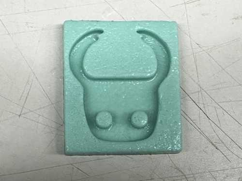

### Hard Cast from Soft Mold

After letting the soft mold cure for a considerable amount of time, it eventually stopped being sticky. After that, I was able to cast the hard piece.

As per the recommendation of some of my peers, I used [Task 8](https://www.smooth-on.com/tb/files/TASK_8_TB.pdf) resin for the hard cast. In the datasheet, similarly to the Mold Star 15 Slow, there were parts A and B, and they needed to be mixed in a 1A:1B ratio.

After mixing the two parts separately, I poured them together, mixed them, and quickly poured the mixture into my mold since it has a pot life of 2.5 minutes. The mixture hardened very quickly, and here is a video of it:

<video width="640" height="320" muted controls><source src="../../videos/week12/Week12-Hard-Curing.mp4" type="video/mp4"/>The video is not supported in your browser.</video>

Here is the fully cured mixture in the mold:

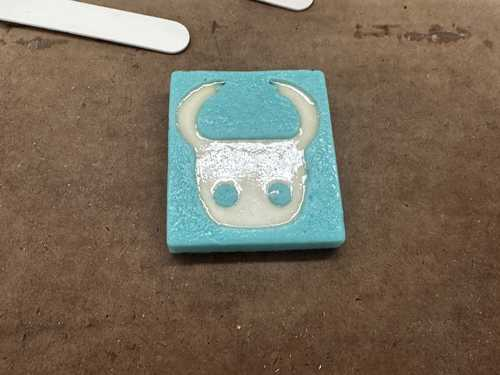

Since the soft mold had imperfections from the resin mold, the hard cast came out with quite a few bumps. Here is the rough cast taken out of the mold:

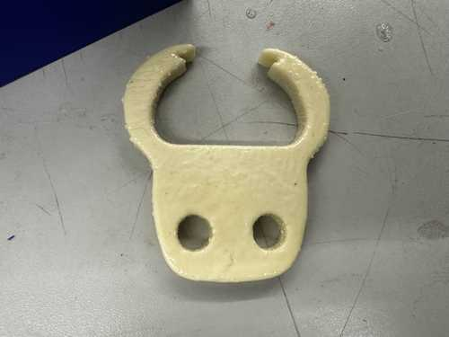

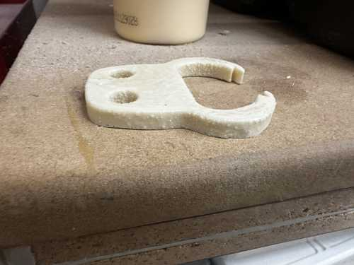

Since I wanted this cast to be displayed somewhere, I decided to make the cast smoother. To do this, I used sandpaper, starting from 100 grit and ending with 320 grit.

Here is the fully polished piece. Note that it was hard to apply sandpaper to the corners and inside of the two holes.

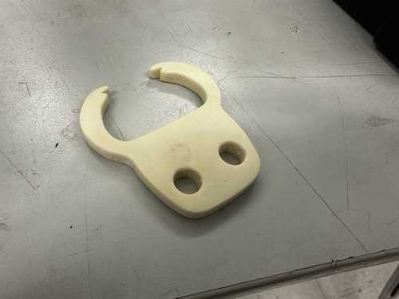

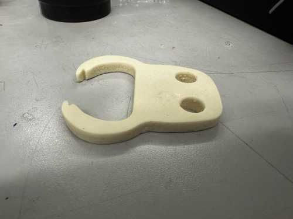

## Group Portion

This week, I worked with Richard Shan. Our documentation can be found [here](https://fabacademy.org/2024/labs/charlotte/assignments/week12a/).

I helped to make comparisons between the Mold Star 15 Slow and TASK 8 products, and I also made casts with both of those products to be compared. 

I also contributed to the comparison between the different processes to make a mold.

## Reflection

This week was not my favorite, but I did feel that learning how to make molds and cast using different materials is useful for future projects. At first, I struggled to understand why I needed a soft mold to make a hard cast, but I eventually figured out that it could simply not be removed. Also, this week improved my skills in 3D printing and using my lab's milling machines, since all of those processes were used to create molds and compare them. I also learned how to use my lab's resin 3D printer. Its jobs take a while to complete, but the product comes out fairly nicely.

## Credits

All credits are mentioned where they are used respectively.