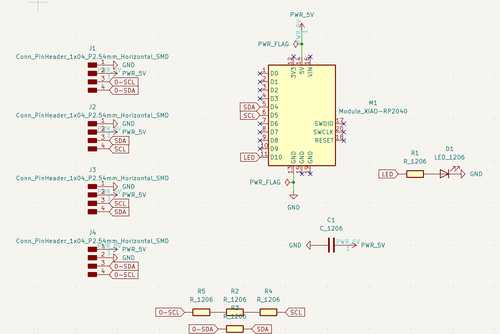
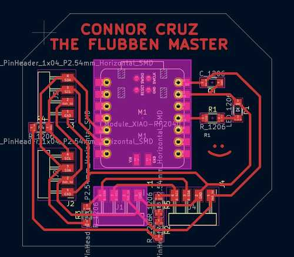
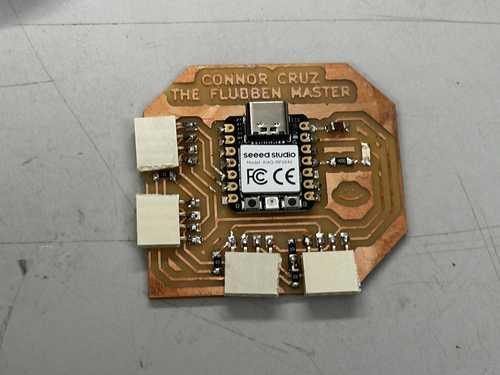
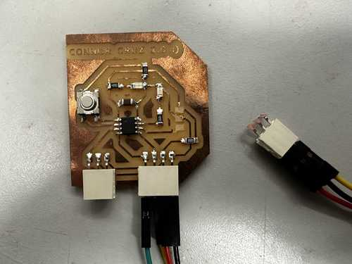

# 13. Networking and Communications

This week, I worked on communication between several microcontrollers using the I2C protocol.

You can find the files used for this week [here](../files/Week13-Files.zip).

For my slave modules, I used the Connor Cruz 1.0 and 2.0 boards, which can be found in [Week 8](../files/Week08-Files.zip) and [Week 9](../files/Week09-Files.zip).

## Master Board

Since I had used I2C in previous weeks for the OLED screen, and I wanted to include other modules along with it, I decided to network using I2C. I wasn't entirely sure of how it could communicate with multiple devices, so I looked at a couple of tutorials such as [this one](https://www.youtube.com/watch?v=6IAkYpmA1DQ). 

## Designing Master

Once I had a general idea of how I2C worked, I quickly designed a master board with multiple headers for SDA, SCL, 5V, and GND connected. I also included an LED to test reading from the slave modules. I used a Xiao RP2040 chip as the microcontroller because I plan to use that for my final project.





Looking back at the board design, I probably should have placed the LED on an analog pin for easier reading of sensors, and I could have allowed more ports connected to headers to get more use out of the board. However, this would work well for the week.

I milled and stuffed the board, and it seemed to work well. Here is the final board: **The Flubben Master**:



## Testing and Programming

I wanted to use my **Connor Cruz 2.0 :)** board and my **Connor Cruz :)** board to connect to the SDA and SCL lines the Xiao RP2040 was connected to. Alas, when I was handling the Connor Cruz 2.0, I accidentally removed one of the headers, which caused 3 pads to rip. Since they were connected to multiple traces, I decided to simply remake the board.

Here is the board with ripped traces:



While that board was broken, I tried testing the Connor Cruz (1.0) with the Flubben Master. I needed to write code for both microcontrollers to determine their function. For both, I used the [*Wire*](https://www.arduino.cc/reference/en/language/functions/communication/wire/) library, which is a library for communication between I2C devices.

For the master board, I wrote two separate functions depending on whether I wanted to receive input from the slave modules or output to the slave modules. I used the readSlave9() function to obtain data from the slave modules, and I used the writeSlaves() function to blink the slaves in order.

For the slave boards, I assigned their addresses and assigned functions for both when data is sent from the slave and received by the slave. Specifically, I made the button send a boolean to the master module depending on whether it was pressed, and the writeSlaves() function on the master module determined the state of an LED on the slave modules.

### Code

Master Code:

```C
#include <Wire.h>

int led = 3;

void writeSlaves() {
    Wire.beginTransmission(8);
    Wire.write(1);
    Wire.endTransmission();
    Wire.beginTransmission(9);
    Wire.write(0);
    Wire.endTransmission();
    delay(500);
    
    Wire.beginTransmission(9);
    Wire.write(1);
    Wire.endTransmission();
    Wire.beginTransmission(8);
    Wire.write(0);
    Wire.endTransmission();
    delay(500);
}

void readSlave9() {
    Wire.requestFrom(9, 1);
  
    int receiveVal = Wire.read();
    if (receiveVal == 1) digitalWrite(led, HIGH);
    else digitalWrite(led, LOW);
}

void setup() {
  Wire.begin();
  pinMode(led, OUTPUT);
}

void loop() {
  //Uncomment one of these depending on the desired function  
  writeSlaves();
  //readSlave9();
}
```

Slave Input/Output Code:

```C
#include <Wire.h>
int output = 0;

void setup() {
  pinMode(4, OUTPUT);
  pinMode(0, INPUT);
  
  //Change the address for each slave board
  Wire.begin(9);
  Wire.onReceive(recieveData);
  Wire.onRequest(sendData);
}
void loop() {
  digitalWrite(4, output);
  delay(100);
}

void recieveData() {
  while (Wire.available())
  {
    output = Wire.read();
  }
}

void sendData() {
  bool buttonPressed = digitalRead(0);
  if (buttonPressed) Wire.write(1);
  else Wire.write(0);
}

```

### Working Output and Input

Here is the working output:

<center>
<video width="640" height="320" muted controls><source src="../../videos/week13/Week13-Networking-Output.mp4" type="video/mp4"/>The video is not supported in your browser.</video>
</center>

Here is the working input:

<center>
<video width="640" height="320" muted controls><source src="../../videos/week13/Week13-Networking-Input.mp4" type="video/mp4"/>The video is not supported in your browser.</video>
</center>

## Group Portion

I worked with Richard Shan this week. You can find our documentation [here](https://fabacademy.org/2024/labs/charlotte/assignments/week13a/).

For this week, I configured my board, which had a Xiao RP2040, to send a signal through I2C to turn on an LED on a slave board when power was supplied by Richard's ESP32. This was not too different from what I did in my individual section.

I also helped with the design of the NPN transistor board, since although voltage was being supplied to my board from the ESP32, it was not a full 5V. Since my board used the 5V pin of the RP2040, we created a board using an NPN transistor to transmit 5V.

## Reflection

This week was very interesting, and I feel that it will be very important to know in general. Since certain microcontrollers might not have enough ports for one's desired function, or they might not have enough memory to handle certain libraries, networking between several microcontrollers and output/input devices can help to solve those problems. I chose I2C since some of the sensors for my final project might involve them, but I primarily focused on networking between microcontrollers so that I could use the memory of a Xiao RP2040 chip with several other microcontrollers to allow for more available pins.

Future Note: Later on, I did learn a couple of other protocols such as UART and SPI, but I2C definitely helped for my final project in that I needed to connect a Xiao RP2040 and ATTiny1614. Also, this work helped with troubleshooting TLE493D hall effect sensors since they were I2C components, but I eventually scrapped them.

## Credits

All credits are mentioned where they are used respectively.