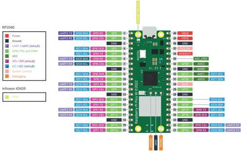
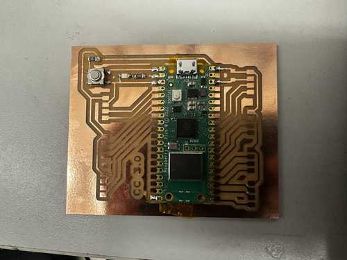

# 14. Interface and Application Programming

This week I worked on creating an interface using MQTT.

## Ideas and Setup

### General Idea

I decided to use the Raspberry Pi Pico W for intefacing since my lab had recently had a couple of them imported, and I could use it to easily connect to WiFi.

Here is a pinout I found on [this website](https://www.raspberrypi-spy.co.uk/2022/11/pi-pico-w-pinout-and-power-pins/):



The idea of MQTT in Neil's lecture sounded like a fun idea to implement, so I chose to use MQTT for my interface. My instructor, Mr. Dubick, gave a very helpful link for starting out with MQTT at [this link](https://www.tomshardware.com/how-to/send-and-receive-data-raspberry-pi-pico-w-mqtt).

### Setting Up Software

I first obtained the Micropython firmware for my Pico W, which can be found [here](https://micropython.org/download/rp2-pico-w/rp2-pico-w-latest.uf2). I then connected the Pico W to my computer while holding the BOOTSEL button, and I imported the uf2 file onto the chip.

The guide I used involved using Micropython with [Thonny](https://thonny.org/). Since I have not worked with Micropython before, I decided to try it out for the sake of learning it. In Thonny, I installed the umqtt.simple package, since it would allow me to use basic MQTT functions.

After downloading Thonny, I also downloaded Eclipse Mosquitto, which would allow me to easily communicate with the established MQTT server.

## Board Creation

Since I had not used a Pico W before, I needed to make another board for it. I included the Pico W, a button, a programmable LED, and many connectable ports. Milling and stuffing the board was not too hard, but it was slightly annoying to get all of the headers on. Originally, I was planning to use all of the ports of the Pico W, but I realized that it would be unreasonable to fit that into one board.

Here is the final board:



## Programming

I created a new file on my Pico W named 'main.py'. I wanted name it this because main.py runs automatically when power is supplied to the chip. This would allow me to simply plug it into an outlet (with an ACDC converter) and have the program run without any external input.

The guide I used had most of what I needed to communicate, but I wanted to use a different server. I used the server that Neil linked in his presentation: mqtt.fabcloud.org

This server also required extra steps for establishing a client connection: a username, password, and port. These had already been given, so I simply added them to the code.

I then added a function to blink an LED whenever the message "LED ON" was published to the server. This was fairly simple, but I needed to learn how to communicate with pins in Micropython first. I also added a function to send a message to the server when a button was pressed.

Here is my final code:

```Python
import network
import time
from machine import Pin
from umqtt.simple import MQTTClient

wlan = network.WLAN(network.STA_IF)
wlan.active(True)
wlan.connect('SSID', 'SECURITY KEY')

time.sleep(5)
print('Connected:', wlan.isconnected())

mqtt_server = 'mqtt.fabcloud.org'
broker_port = 1883
client_id = 'fabstudent'
username = 'fabacademy'
password = 'fabacademy'
topic = 'fabacademy'

client = MQTTClient(client_id, mqtt_server, port=broker_port,
        user=username, password=password, keepalive=3600)

ledOn = False
ledPin = Pin(27, Pin.OUT)
buttonPin = Pin(0, Pin.IN)

def mqtt_connect():
    try:
        client.connect()
        print('Broker connected successfully')
    except Exception as e:
        print('Failed broker connection: ', e)

def reconnect():
    print('Reconnecting to broker')
    time.sleep(5)
    machine.reset()
    
def publish(topic, msg):
    try:
        client.publish(topic, msg)
        print(f'Published {msg} to {topic}')
    except Exception as e:
        print('Error publishing to topic:', e)

def subscribe(topic):
    try:
        client.subscribe(topic)
        print('Subscribed to topic:', topic)
    except Exception as e:
        print('Error subscribing to topic:', e)
        
def callback(topic, msg):
    global ledOn
    print(f'Received message on topic: {topic}; Message: {msg}')
    if msg == b'LED ON':
        ledOn = True
        
def ledBlink():
    global ledOn
    client.check_msg()
    if ledOn:
        print('ON')
        ledPin.value(1)
        time.sleep(0.5)
        ledPin.value(0)
        ledOn = False
        
def buttonPress():
    buttonPressed = buttonPin.value()
    if buttonPressed:
        publish(topic, 'Button Pressed!')

try:
    mqtt_connect()
    client.set_callback(callback)
except OSError as e:
    reconnect()
            
subscribe(topic)

while True:
    #Uncomment one call depending on input or output
    ledBlink()
    #buttonPress()
    time.sleep(0.1)
```

Here are the commands I used on my computer for the respective subscription to the server and publishing of the message "LED ON":
```
mosquitto_sub -h mqtt.fabcloud.org -u fabacademy -P fabacademy -p 1883 -t fabacademy
```

```
mosquitto_pub -h mqtt.fabcloud.org -u fabacademy -P fabacademy -p 1883 -t fabacademy -m "LED ON"
```

Here is the functioning LED blink. It successfully blinks the LED when "LED ON" is published to the server.

<center>
<video width="640" height="320" muted controls><source src="../../videos/week14/Week14-LED.mp4" type="video/mp4"/>The video is not supported in your browser.</video>
</center>

Here is the functioning button press. It successfully sends a message to the server when it is pressed.

<center>
<video width="640" height="320" muted controls><source src="../../videos/week14/Week14-Button.mp4" type="video/mp4"/>The video is not supported in your browser.</video>
</center>

## Server Interface

After I got the transmission to and from the server to work, I created a GUI interface to interact with my board. I had used Tk in previous projects of mine, so I decided to use [Tkinter](https://docs.python.org/3/library/tkinter.html) with Python in Thonny.

I used [this guide](https://www.emqx.com/en/blog/how-to-use-mqtt-in-python) to learn how to communicate with MQTT in Python, since I would have to use different packages than those used for the Pico W (since that was specifically configured for the microcontroller).

Here are some aspects I included in the program: text boxes for the user to input the server information and desired message, a button to set those values to the configured values for my Connor Cruz 3.0 board, a button to publish the inputted message to the server, a text box showing the last 5 messages in the server, and a label showing whether the button is being pressed or not.

Here is the code:

```Python
import tkinter as tk
import paho.mqtt.publish as publish
import paho.mqtt.client as mqtt

latestMessages = ["", "", "", "", ""]

def publishMessage():
    host = hostInput.get()
    topic = topicInput.get()
    msg = messageInput.get()
    port = portInput.get()
    usrname = usernameInput.get()
    pswd = passwordInput.get()
    print(host, topic, msg, port, usrname, pswd)
    publish.single(topic, msg, hostname=host, port=int(port), auth={'username': usrname, 'password': pswd})

def defaultSet():
    hostInput.delete(0, tk.END)
    hostInput.insert(0, "mqtt.fabcloud.org")
    topicInput.delete(0, tk.END)
    topicInput.insert(0, "fabacademy")
    messageInput.delete(0, tk.END)
    messageInput.insert(0, "LED ON")
    portInput.delete(0, tk.END)
    portInput.insert(0, "1883")
    usernameInput.delete(0, tk.END)
    usernameInput.insert(0, "fabacademy")
    passwordInput.delete(0, tk.END)
    passwordInput.insert(0, "fabacademy")
    
def onConnect(client, userdata, flags, rc):
    if rc == 0:
        print("Connected to broker")
        client.subscribe("fabacademy")
    else:
        print("Connection to broker failed")

def onMessage(client, userdata, msg):
    global latestMessages
    message = msg.payload.decode()
    print("Received message:", message)
    latestMessage = message
    
    for i in range(0, 4):
        latestMessages[i] = latestMessages[i + 1]
    
    latestMessages[4] = message
    outputDisplay.delete(1.0, tk.END)
    for i in latestMessages:
        if i == "":
            continue
        outputDisplay.insert(tk.END, i + "\n")
    
    if latestMessage == "Button Pressed!":
        buttonPressed.config(text="BUTTON PRESSED")
        buttonPressed.config(bg="lightgreen")
    elif latestMessage == "Button Not Pressed!":
        buttonPressed.config(text="BUTTON NOT PRESSED")
        buttonPressed.config(bg="red")

root = tk.Tk()
root.title("Connor Cruz 3.0 Interface")

inputFrame = tk.Frame(root)
inputFrame.pack(side=tk.LEFT, padx=10)

hostLabel = tk.Label(inputFrame, text="Host:")
hostLabel.grid(row=0, column=0)
hostInput = tk.Entry(inputFrame, width=50)
hostInput.grid(row=0, column=1)

topicLabel = tk.Label(inputFrame, text="Topic:")
topicLabel.grid(row=1, column=0)
topicInput = tk.Entry(inputFrame, width=50)
topicInput.grid(row=1, column=1)

messageLabel = tk.Label(inputFrame, text="Message:")
messageLabel.grid(row=2, column=0)
messageInput = tk.Entry(inputFrame, width=50)
messageInput.grid(row=2, column=1)

portLabel = tk.Label(inputFrame, text="Port:")
portLabel.grid(row=3, column=0)
portInput = tk.Entry(inputFrame, width=50)
portInput.grid(row=3, column=1)

usernameLabel = tk.Label(inputFrame, text="Username:")
usernameLabel.grid(row=4, column=0)
usernameInput = tk.Entry(inputFrame, width=50)
usernameInput.grid(row=4, column=1)

passwordLabel = tk.Label(inputFrame, text="Password:")
passwordLabel.grid(row=5, column=0)
passwordInput = tk.Entry(inputFrame, width=50)
passwordInput.grid(row=5, column=1)

defaultButton = tk.Button(inputFrame, text="Connor Cruz 3.0 Default", command=defaultSet, width=50)
defaultButton.grid(row=6, column=0, columnspan=2)

publishButton = tk.Button(inputFrame, text="Publish", command=publishMessage, width=50)
publishButton.grid(row=7, column=0, columnspan=2)

outputFrame = tk.Frame(root)
outputFrame.pack(side=tk.RIGHT, padx=10, pady=10)
outputLabel = tk.Label(outputFrame, text="Server Output (Most Recent Messages):")
outputLabel.grid(row=0)
outputDisplay = tk.Text(outputFrame, width=50, height=5)
outputDisplay.grid(row=1)

buttonFrame = tk.Frame(outputFrame)
buttonFrame.grid(row=2, pady=10)

buttonPressed = tk.Label(buttonFrame, width=58, height=5, text="BUTTON NOT PRESSED", bg="red")
buttonPressed.pack()

client = mqtt.Client()
client.on_connect = onConnect
client.on_message = onMessage

client.username_pw_set(username="fabacademy", password="fabacademy")

client.connect("mqtt.fabcloud.org", 1883)

client.loop_start()

root.mainloop()
```

Here is the working program:

<center>
<video width="640" height="320" muted controls><source src="../../videos/week14/Week14-ApplicationGUI.mp4" type="video/mp4"/>The video is not supported in your browser.</video>
</center>

## Group Portion

I worked with Richard Shan this week. Our documentation can be found [here](https://fabacademy.org/2024/labs/charlotte/assignments/week14a/).

We both worked to formulate a list of similarities and differences between our two projects this week. We compared both using Python and HTML to create our GUI interfaces, as well as comparing and contrasting the use of HTTP and MQTT for server management. We included topics such as accessibility to use these different methods and how reliable they are.

## Reflection

This week was very fun, but it took a while to get the MQTT communication to work. I felt like it was a really important skill to learn since it made me consider both how to publish to a server and subscribe to lsiten to that server. The wireless communication also enlightened me on how to connect to WiFi from a microcontroller and allow for transmission without a direct connection. Overall, I think that creating GUIs in the future will be very useful, and I could possibly use this on the screen for my final project.

## Credits

Thanks to Mr. Dubick for compiling several easily accessible resources to learn how to use MQTT. All other credits are mentioned where they are used respectively.