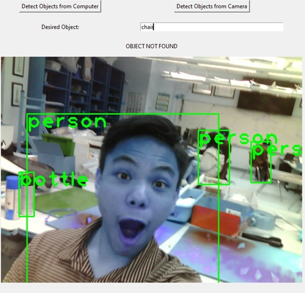

# 15. Wildcard Week

This week I worked on using machine vision to generally detect objects from a camera.

## Idea

For this week, I have an interest in machine learning algorithms, so I decided to use Neil's suggestion of detecting objects.

My general idea was to establish a server where an ESP32CAM module and a laptop to communicate through an MQTT server. The laptop would have a GUI where if a button is clicked, a message is sent to take a picture with the ESP32, and the data for that image is transferred through the server. The program on the laptop then uses the YOLO algorithm to detect objects, and the image is displayed with those elements modified.

Here is a brief summary:

- Laptop sends message to server to take picture
- ESP32 takes picture
- ESP32 sends picture to server
- Laptop receives image
- Laptop detects objects
- Laptop displays image with detected objects

## Programming Laptop GUI

### Local Pictures

To start, I made some basic code for the laptop interface. Since I had already done this in [Interfacing Week](../assignments/week14.md), I replicated most of the code with some changes to fit the program I wanted to create.

To the program, I added the object detection features. I decided to use the[**YOLO algorithm**](https://www.v7labs.com/blog/yolo-object-detection).

I used many sources for reference on this, including [this one](https://towardsdatascience.com/yolo-object-detection-with-opencv-and-python-21e50ac599e9).

For fun, I also allowed it to be able to detect objects on local image files. Here is an example:

<center>
<video width="640" height="320" muted controls><source src="../../videos/week15/Week15-ComputerImage.mp4" type="video/mp4"/>The video is not supported in your browser.</video>
</center>

### ESP32 Pictures

Next, I configured the program to handle pictures send to the MQTT stream by the ESP32. 

I first made a button to take a picture on the ESP32, which sent the message **TAKE PICTURE** to the MQTT server.

I was unsure how to get started with this, but I looked at some forums and determined that the ESP32CAM has images stored in the **byte array format**. Since this could be quite large, I anticipated that I would have to chunk this data (with experimentation later, I decided to use a chunk size of 128).

I wrote some code to join together the byte arrays from multiple messages. When the message **START** was published to the server, it would start detecting the individual chunks, and when **END** was published, it would stop detecting them and join them together to form the full byte array. Next, it would convert this to a blob, allowing it to be parsed by the YOLO algorithm.

### Full Code

Here is all of my code for both of these segments:

```Python
import cv2
import numpy as np
import paho.mqtt.client as mqtt
import paho.mqtt.publish as publish
import tkinter as tk
import io
from tkinter import filedialog
from PIL import ImageTk, Image

img_label = None
computerImage = True

confidenceValue = 0.6

transferImage = False
byteString = b""

def imageDetect(blob, height, width, img):
    global img_label, img_result

    net = cv2.dnn.readNet("C:/FabAcademy/Week15/yolov3.weights", "C:/FabAcademy/Week15/yolov3.cfg")
    classes = []
    with open("C:/FabAcademy/Week15/classes.txt", "r") as f:
        classes = [line.strip() for line in f.readlines()]

    layer_names = net.getLayerNames()
    output_layers = [layer_names[i - 1] for i in net.getUnconnectedOutLayers()]

    net.setInput(blob)
    outs = net.forward(output_layers)

    class_ids = []
    confidences = []
    boxes = []
    for out in outs:
        for detection in out:
            scores = detection[5:]
            class_id = np.argmax(scores)
            confidence = scores[class_id]
            if confidence > confidenceValue:
                center_x = int(detection[0] * width)
                center_y = int(detection[1] * height)
                w = int(detection[2] * width)
                h = int(detection[3] * height)

                x = int(center_x - w / 2)
                y = int(center_y - h / 2)

                boxes.append([x, y, w, h])
                confidences.append(float(confidence))
                class_ids.append(class_id)

    indexes = cv2.dnn.NMSBoxes(boxes, confidences, 0.5, 0.4)

    for i in range(len(boxes)):
        if i in indexes:
            x, y, w, h = boxes[i]
            label = str(classes[class_ids[i]])
            cv2.rectangle(img, (x, y), (x + w, y + h), (0, 255, 0), 2)
            cv2.putText(img, label, (x, y + 30), cv2.FONT_HERSHEY_PLAIN, 3, (0, 255, 0), 3)

    img_result = cv2.cvtColor(img, cv2.COLOR_BGR2RGB)
    img_result = Image.fromarray(img_result)
    img_result = ImageTk.PhotoImage(img_result)

    if img_label is None:
        img_label = tk.Label(root, image=img_result)
        img_label.grid(row=4, column=1, columnspan=2)
    else:
        img_label.configure(image=img_result)
        img_label.image = img_result
    
    objectFound = False
    for i in class_ids:
        label = str(classes[i])
        if label == objectInput.get():
            publish.single('fabacademy', 'LED ON', hostname='mqtt.fabcloud.org', port=1883, auth={'username': 'fabacademy', 'password': 'fabacademy'})
            objectFound = True
            foundLabel.config(text="OBJECT FOUND!")
            print("LED ON")
            break
    if not objectFound:
        print("LED OFF")
        foundLabel.config(text="OBJECT NOT FOUND")
        print("Object not found")
            
def onConnect(client, userdata, flags, rc):
    if rc == 0:
        print("Connected to broker")
        client.subscribe("fabacademy")
    else:
        print("Connection to broker failed")
        
def onMessage(client, userdata, msg):
    global byteString, transferImage

    if msg.payload == b"START":
        print("STARTED")
        byteString = b""
        transferImage = True
    elif msg.payload == b"END":
        print("ENDED")
        if transferImage:
            try:
                img = Image.open(io.BytesIO(byteString))
                img = img.resize((int(img.size[0] * 0.4), int(img.size[1] * 0.4)))
                width, height = img.size

                blob = cv2.dnn.blobFromImage(np.array(img), 0.00392, (416, 416), (0, 0, 0), True, crop=False)

                imageDetect(blob, height, width, np.array(img))
            except Exception as e:
                print("Error:", e)
        transferImage = False
    else:
        if transferImage:
            byteString += msg.payload

    
def computerGet():
    computerImage = True
    file_path = filedialog.askopenfilename()
    if file_path:
        img = cv2.imread(file_path)
        img = cv2.resize(img, None, fx=0.4, fy=0.4)
        height, width, channels = img.shape

        blob = cv2.dnn.blobFromImage(img, 0.00392, (416, 416), (0, 0, 0), True, crop=False)
                
        imageDetect(blob, height, width, img)
        return "Obtained image from path"
    else:
        return "Failed to get image from path"
    
def espGet():
    computerImage = False
    publish.single('fabacademy', 'TAKE PICTURE', hostname='mqtt.fabcloud.org', port=1883, auth={'username': 'fabacademy', 'password': 'fabacademy'})

root = tk.Tk()
root.title("Object Detection Program")
root.geometry("500x500")

computerButton = tk.Button(root, text="Detect Objects from Computer", command=computerGet)
computerButton.grid(row=1, column=1, padx=20, pady=10)
cameraButton = tk.Button(root, text="Detect Objects from Camera", command=espGet)
cameraButton.grid(row=1, column=2, padx=20, pady=10)

objectLabel = tk.Label(root, text="Desired Object:")
objectLabel.grid(row=2, column=1, padx=20, pady=10)
objectInput = tk.Entry(root, width=50)
objectInput.grid(row=2, column=2, padx=20, pady=10)

foundLabel = tk.Label(root, text="OBJECT FOUND STATUS")
foundLabel.grid(row=3, column=1, columnspan=2, padx=20, pady=10)

client = mqtt.Client()
client.on_connect = onConnect
client.on_message = onMessage

client.username_pw_set(username="fabacademy", password="fabacademy")

client.connect("mqtt.fabcloud.org", 1883)

client.loop_start()

root.mainloop()
```

## Programming the ESP32

Here is an image of my ESP32CAM:


### Attempting to use Micropython

Originally, I had tried using Micropython to upload code to the ESP32, but even after downloading and uploading the correct firmware from [this repo](https://github.com/lemariva/micropython-camera-driver/tree/master/firmware), it produced this error:

```
Couldn't find the device automatically. 
Check the connection (making sure the device is not in bootloader mode) or choose
"Configure interpreter" in the interpreter menu (bottom-right corner of the window)
to select specific port or another interpreter.

Process ended with exit code None.
```

### Changing Methods

I couldn't figure out how to fix this, so by the suggestion of my colleague [Richard Shan](https://fabacademy.org/2024/labs/charlotte/students/richard-shan/), who had worked with the ESP32CAM before, I used Arduino to program it.

I tried using **ArduinoMQTTClient** for a while, but I couldn't get that to work at all no matter how much I debugged. Eventually, I settled for another library.

[This guide](http://www.steves-internet-guide.com/using-arduino-pubsub-mqtt-client/) really helped me to learn how to use **PubSubClient** for MQTT in Arduino.

I wrote code to connect the ESP to a WiFi network and the MQTT server, which was successful. I set a callback function which would run whenever a message was received on the server. In the callback function, I checked whether the message read "TAKE PICTURE", and if it did, the **captureAndSendMessage()** function would be called.

I needed to research how to traverse a byte array, and I was eventually able to write this code segment to take the picture and publish its data as a byte array to the MQTT stream. For some reason, chunk sizes of powers of 2 greater than 128 bytes did not work, so I stuck with that chunk size. Here is the segment:

```C
camera_fb_t *fb = esp_camera_fb_get();
  if (!fb) {
    Serial.println("Camera capture failed");
    return;
  }

  Serial.printf("Captured image with size %u\n", fb->len);

  // Publish image bytes to MQTT server in chunks
  const int chunkSize = 128;
  int remaining = fb->len;
  byte* bufferPointer = fb->buf;
  mqttClient.publish(mqtt_topic, "START");
  Serial.println("STARTED");
  while (remaining > 0) {
    int chunkLength = min(remaining, chunkSize);
    if (!mqttClient.publish(mqtt_topic, (unsigned char *)bufferPointer, chunkLength)) {
      Serial.println("Failed to publish image");
      mqttClient.publish(mqtt_topic, "END");
      break;
    }
    bufferPointer += chunkLength;
    remaining -= chunkLength;
  }
  mqttClient.publish(mqtt_topic, "END");
  Serial.println("ENDED");
```

For a long time, I struggled to get the message to actually publish. I realized that the problem was that I had not converted the bufferPointer to an unsigned character pointer, which is the data type specified in the PubSubClient documentation.

### Working Transfer

Note: Here are some examples of images taken and a video of the process:

<center>
<video width="640" height="320" muted controls><source src="../../videos/week15/Week15-ESPTestVideo.mp4" type="video/mp4"/>The video is not supported in your browser.</video>
</center>




### Full Code

Here is the full code for the ESP32CAM. Pin definition and configuration was obtained from Richard Shan on [his documentation](https://fabacademy.org/2024/labs/charlotte/students/richard-shan/lessons/week13/networking/):

```C
#include <WiFi.h>
#include <PubSubClient.h>
#include "esp_camera.h"

const char* ssid = "SSID";
const char* password = "SECURITY KEY";

const char* mqtt_server = "mqtt.fabcloud.org";
const int mqtt_port = 1883;
const char* mqtt_user = "fabacademy";
const char* mqtt_password = "fabacademy";
const char* mqtt_topic = "fabacademy";

// Pin definition for ESP32CAM
#define PWDN_GPIO_NUM     32
#define RESET_GPIO_NUM    -1
#define XCLK_GPIO_NUM     0
#define SIOD_GPIO_NUM     26
#define SIOC_GPIO_NUM     27

#define Y9_GPIO_NUM       35
#define Y8_GPIO_NUM       34
#define Y7_GPIO_NUM       39
#define Y6_GPIO_NUM       36
#define Y5_GPIO_NUM       21
#define Y4_GPIO_NUM       19
#define Y3_GPIO_NUM       18
#define Y2_GPIO_NUM       5
#define VSYNC_GPIO_NUM    25
#define HREF_GPIO_NUM     23
#define PCLK_GPIO_NUM     22

WiFiClient espClient;
PubSubClient mqttClient(espClient);

void setup() {
  Serial.begin(9600);

  WiFi.begin(ssid, password);
  while (WiFi.status() != WL_CONNECTED) {
    delay(500);
    Serial.print(".");
  }
  Serial.println("\nWiFi connected");

  mqttClient.setServer(mqtt_server, mqtt_port);
  mqttClient.setCallback(messageReceived);

  while (!mqttClient.connected()) {
    Serial.print("Attempting MQTT connection...");
    if (mqttClient.connect("ESP32-CAM", mqtt_user, mqtt_password)) {
      Serial.println("connected");
      mqttClient.subscribe(mqtt_topic);
    } else {
      Serial.print("failed, rc=");
      Serial.print(mqttClient.state());
      Serial.println(" retrying in 5 seconds");
      delay(5000);
    }
  }

  camera_config_t config;
  config.ledc_channel = LEDC_CHANNEL_0;
  config.ledc_timer = LEDC_TIMER_0;
  config.pin_d0 = Y2_GPIO_NUM;
  config.pin_d1 = Y3_GPIO_NUM;
  config.pin_d2 = Y4_GPIO_NUM;
  config.pin_d3 = Y5_GPIO_NUM;
  config.pin_d4 = Y6_GPIO_NUM;
  config.pin_d5 = Y7_GPIO_NUM;
  config.pin_d6 = Y8_GPIO_NUM;
  config.pin_d7 = Y9_GPIO_NUM;
  config.pin_xclk = XCLK_GPIO_NUM;
  config.pin_pclk = PCLK_GPIO_NUM;
  config.pin_vsync = VSYNC_GPIO_NUM;
  config.pin_href = HREF_GPIO_NUM;
  config.pin_sscb_sda = SIOD_GPIO_NUM;
  config.pin_sscb_scl = SIOC_GPIO_NUM;
  config.pin_pwdn = PWDN_GPIO_NUM;
  config.pin_reset = RESET_GPIO_NUM;
  config.xclk_freq_hz = 20000000;
  config.frame_size = FRAMESIZE_UXGA;
  config.pixel_format = PIXFORMAT_JPEG; 
  config.grab_mode = CAMERA_GRAB_WHEN_EMPTY;
  config.fb_location = CAMERA_FB_IN_PSRAM;
  config.jpeg_quality = 12;
  config.fb_count = 1;

  if (psramFound()) {
    config.jpeg_quality = 10;
    config.fb_count = 2;
    config.grab_mode = CAMERA_GRAB_LATEST;
  }

  esp_err_t err = esp_camera_init(&config);
  if (err != ESP_OK) {
    Serial.printf("Camera init failed with error 0x%x", err);
    return;
  }

  Serial.println("Camera initialized successfully");
}

void loop() {
  if (!mqttClient.connected()) {
    reconnect();
  }
  mqttClient.loop();
  delay(500);
}

void reconnect() {
  while (!mqttClient.connected()) {
    Serial.print("Attempting MQTT connection...");
    if (mqttClient.connect("ESP32-CAM", mqtt_user, mqtt_password)) {
      Serial.println("connected");
      mqttClient.subscribe(mqtt_topic);
    } else {
      Serial.print("failed, rc=");
      Serial.print(mqttClient.state());
      Serial.println(" retrying in 5 seconds");
      delay(5000);
    }
  }
}

void messageReceived(char* topic, byte* payload, unsigned int length) {
  Serial.println("Message received");
  String receivedMessage = "";
  for (int i = 0; i < length; i++) {
    receivedMessage += (char)payload[i];
  }

  if (receivedMessage == "TAKE PICTURE") {
    captureAndSendImage();
  }
}

void captureAndSendImage() {
  camera_fb_t *fb = esp_camera_fb_get();
  if (!fb) {
    Serial.println("Camera capture failed");
    return;
  }

  Serial.printf("Captured image with size %u\n", fb->len);

  const int chunkSize = 128;
  int remaining = fb->len;
  byte* bufferPointer = fb->buf;
  mqttClient.publish(mqtt_topic, "START");
  Serial.println("STARTED");
  while (remaining > 0) {
    int chunkLength = min(remaining, chunkSize);
    if (!mqttClient.publish(mqtt_topic, (unsigned char *)bufferPointer, chunkLength)) {
      Serial.println("Failed to publish image");
      mqttClient.publish(mqtt_topic, "END");
      break;
    }
    bufferPointer += chunkLength;
    remaining -= chunkLength;
  }
  mqttClient.publish(mqtt_topic, "END");
  Serial.println("ENDED");

  esp_camera_fb_return(fb);
}
```

## Reflection

This week was very fun, but it took quite a while and many different methods to resolve the problems I had. Since this topic is completely new to me, I had to constantly debug, and most of it was quite frustrating. However, after fixing everything, I feel like I have learned much more about servers, how AI image detection works, and improved my coding skills in Python and C++. Overall, this seems like an interesting thing to pursue further at a later time.

## Credits

Thanks to [Richard Shan](https://fabacademy.org/2024/labs/charlotte/students/richard-shan/) for suggesting and giving advice on the ESP32CAM chip. All other credits are mentioned where they are used respectively.