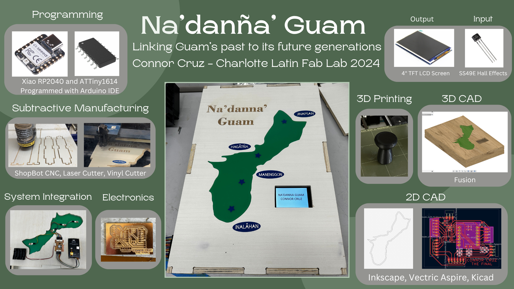

# 18. Invention, Intellectual Property, and Income

This week I worked on future plans for my final project and how I want it to be distributed.

## Licensing and Copyright

To decide which license I wanted, I looked at a [helpful libguide](https://pitt.libguides.com/copyright/licenses).

I would prefer a Creative Commons license since it keeps the project open source and is very commonly used. I want attribution to my project if it is used anywhere, so I would like to apply the *BY* component. I also do not want others to profit off of my design, nor do I want any derivative works to be made, so I decided on the *NC* and *ND* components.

Thus, the license I wish to apply to my project is:

**CC-BY-NC-ND 4.0**

which is fully known as:

**ATTRIBUTION-NONCOMMERCIAL-NODERIVS 4.0 INTERNATIONAL**

Specific details on this license can be found [here](https://creativecommons.org/licenses/by-nc-nd/4.0/).

## Dissemination Plan

I plan to distribute my project to families who want to teach their children about Guam's culture, national parks in Guam, and schools in Guam in order to keep the culture alive. This will help to achieve my overall goal of linking the present and future generations to Guam's past culture which might not necessarily be taught in schools. The project might also be distributed to United States schools for the purpose of spreading the culture not just to children in Guam but also to more demographics. This might also help to reach the diaspora of Guam who are not as involved in Chamorro culture.

To start with this plan, I could propose this project to relatives who live in and out of Guam, and they could in turn help to promote it to Guam officials. Although only one model is made, it might be able to be displayed in some park. In terms of making other boards, it might take some work for consistent output, and it would be a fairly laborious task.

## Future Possibilities

In the future, I could improve upon this project by adding more sensors and using a larger screen and map of Guam. I can decrease the size of the box I used since I ended up attaching the electronics all to the top face, and I will increase the size of Guam to allow for the larger amount of sensors. This is fairly reasonable to do, but I would have to change the parameters in my box design and cut everything again. This would require buying many of the materials again that were listed in my BOM, but it is fairly doable. Adding more sensors would require rerouting or possibly multiple ATTiny1614s (or a chip with a greater amount of pins), all connected through the same I2C line. Note that this would make the wiring messier, and I might need to find a better way to wire the sensors (since each one requires power, ground, and analog input lines).

## Slide and Video

<video width="700" controls><source src="../../presentation.mp4" type="video/mp4"/>The video is not supported in your browser.</video>

