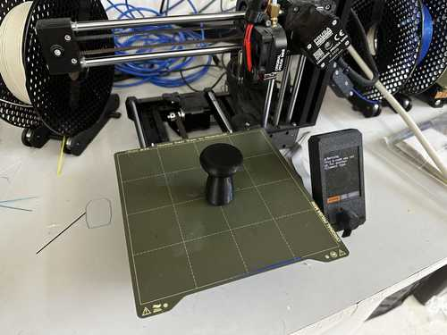
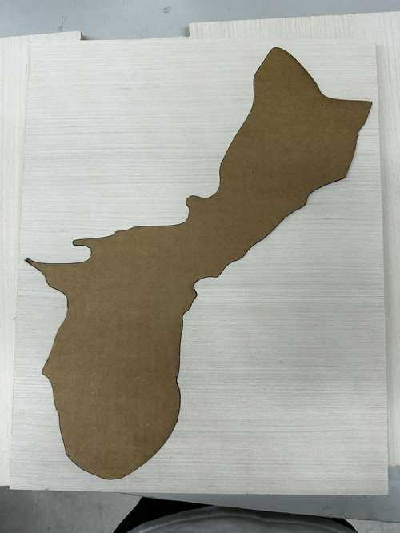
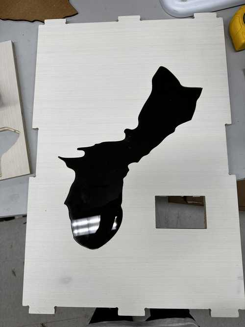

# Final Project - Na'danña' Guam

**Licensed under Creative Commons CC-BY-NC-ND 4.0**

## Slide and Video


<center>
<video width="700" controls><source src="../../presentation.mp4" type="video/mp4"/>The video is not supported in your browser.</video>
</center>

## Files

You can find the files used for this project [here](../files/Final-Files.zip).

## Overview

My final project idea is designed to help teach the culture of my home island, Guam, to those who do not know as much about it.

The project consists of a 16" x 24" board that has an OLED screen along with an acrylic map of Guam. To accompany the board, there will also be a piece similar to a chess pawn in the shape of a latte stone, a cultural symbol.

The island of Guam has sensors at several cultural landmarks marked by a star, and when the latte stone is placed on those sensors, the sensor on the board will cause the screen to display an image of the landmark and toggle through some text about its history and images of the place.

## System Diagram


## Bill of Materials


## General Idea Sketch


## List of Tasks to be Completed

Here is a list of general tasks to be completed and the respective skills they incorporate.

**Electronics:**

- Make main board for Xiao RP2040 (Electronics Design/Production)
- Connect and program OLED screen to display certain images (Networking)
- Design and assemble board for sensors (lectronics Design/Production)
- Program sensors and test them through acrylic (Embedded Programming)

**Board:**

- Make a vector file containing designs for the wooden container (Computer-aided Design)
- Cut the file using the large CNC machine and sand pieces (Computer-controlled Machining)
- Cut acrylic shape of Guam (Computer-controlled Cutting/Laser Cutter)
- Cutting stickers for the board (Computer-controlled Cutting/Vinyl Cutter)
- Engraving project name on board (Computer-controlled Cutting/Laser Cutter)

**General:**

- Design piece with embedded magnet (3D Printing)

**Assembly:**

- Fix screen and acrylic to top wood piece
- Place sides onto container
- Affix RP2040 board and sensor board
- Make hole for power source in one side and assemble all wood pieces

## Initial Gantt Chart for Tasks


## Marker Design in Fusion 360 and 3D Printing

This is the design of the marker that was to be placed on the board. I first designed it in CAD week (Week 2). Here is the initial design I made:


For my final design, I made the bottom of the piece closed and made a hole shaped for a magnet in the middle of the piece. I planned to have the 3D printing job pause and insert the magnet, then continue the job. One slight problem was that supports would be required to have a slot for the magnet, so I made a chamfer above the magnet so that it would still not rattle around when the piece is shaken and so that supports would not be required. Here is the final piece design:


Here is the printed piece:



## Board Outline Design and Cutting

### Cuttle Design

I planned to use a ShopBot or some other CNC machine to cut the board using this Cuttle file. This was later imported into Fusion, and a couple of elements were resized to better fit the final design.


### Fusion Design

For my cut on the CNC machine, I decided to design the different piece outlines as part of a Fusion file so I could see how they all fit together. To hold them together, I used finger joints (but they would also be joined together by glue). The design was not too hard to design since I only needed to make two sketches for the sides and one for the top and bottom.

For a better depiction of my final, I also applied materials to the design so that they could emulate roughly what my design would actually look like. Here is the final design.


### Aspire File and Toolpath

I imported the sketches from Fusion as DXF files into Aspire. Since I used a 3/8" flat end tool for the cut, I also added dog bone fillets on inner right angles in my design to allow for them to fit together successfully during assembly.

Here is a picture of the piece vectors in Aspire:


### Cutting with ShopBot CNC Machine

The cutting process was essentially the same as that of Computer-Controlled Machining week (Week 7). Nothing went too badly during the process. Here is a video of the cut:

<video width="640" height="320" muted controls><source src="../../videos/final/Final-CNC-Outline.mp4" type="video/mp4"/>The video is not supported in your browser.</video>

## Wood Guam Pocket and Acrylic Inlay Cutting

### Pocket in Wood

Since my acrylic was 1/8" and my wood was 1/2" in thickness, I needed to find some way to inlay the acrylic cutout of Guam such that it could be approximately even with the surface of the wood. One slight problem that will be evident later is that the hall effect sensors I would use were not very reliable past 1/2" distance, so I would prefer to have the sensors as close to the acrylic as possible.

I came up with a solution where there would be a full cutout of Guam offset approximately 5 mm inwards and a pocket cut of the actual outline around that profile cut. Note that I made the pocket cut 1/8" deep, as that was how large the acrylic was. It would have been problematic if there were some error in the machine, but luckily, as seen in the next section, the inlay fit almost perfectly. Here are pictures of the Aspire toolpath and simulation.


One slight problem was that I had already cut out the outline of the top piece, so I needed to find some way of fixturing it without breaking the material. To resolve this problem, I used my lab's Nitto double-sided tape. This was a slightly dangerous process, so I needed to make sure that I had an adequate amount and that it was pressed onto the bed firmly enough.

I followed roughly the same steps as cutting the board outline, and the cut thankfully ran successfully.

Here are a video of the cut and the final product:

<video width="640" height="320" muted controls><source src="../../videos/final/Final-CNC-Pocket.mp4" type="video/mp4"/>The video is not supported in your browser.</video>


### Acrylic Inlay

I planned to use the laser cutter to cut the acrylic inlay of Guam. I had a limited amount of green acrylic to cut, so I needed to make some test cuts to ensure that it would actually fit well.

I started by cutting the same vector used for the outside of the Guam pocket but with a 1 mm offset inward. This would hopefully give the cut enough room to fit inside of the cutout. I also used cardboard (which was 1/4") since I did not want to unnecessarily use any acrylic.

My lab's laser cutter has some preset settings for speed, power, and frequency for different materials and types of cuts, so I set it to a cardboard vector cut.

Here is the cardboard cutout in the wood. As you can see, it fit almost perfectly, but a sharp part at the left side of the cutout did not exactly fit. This was likely because a 1/8" bit was not precise enough to accurately cut that section in the wood. Also note that the cardboard did stick out of the wood slightly due to it being 1/4" rather than 1/8".

Here is the cardboard inside of the wood:




I adjusted that part of the vector and re-cut on cardboard, which worked fine. I then moved onto cutting a test piece of acrylic.

I changed the settings on the laser cutter for a vector cut on the acrylic, and fit it in the wood cutout again.

It was essentially a perfect fit with no visible gaps. Also, it was essentially perfect in terms of depth, with an unnoticeable change in depth from the wood to the acrylic.

Here is the acrylic in the wood:



Finally, I ran the cut with my green sheet of acrylic. I used the same settings as the previous acrylic piece, but I had to run the job two times since it did not look like it cut fully through on the first one.

Like the test acrylic, it fit almost perfectly.

## TLE493D Hall Effect Sensor (Failed)

After trying out step response, I realized that it might not be the best for my project, so I switched back to using a hall effect sensor.

I started by using the [TLE493D](https://www.infineon.com/dgdl/Infineon-TLE493D-W2B6-DataSheet-v01_20-EN.pdf?fileId=5546d46261764359016189ec158943a4), which is a 3D I2C hall sensor.

After looking at the datasheet, I noticed that a custom address or multiple addresses cannot be set to the component, so they cannot all be on the same I2C line. To fix this problem, I decided to use the Arduino [TCA9548A](https://www.ti.com/lit/ds/symlink/tca9548a.pdf) Multiplexer, since it is able to handle multiple I2C devices of the same address.

### Getting One TLE493D to Work

This was a fairly simple process, and I referred to the documentation listed in the documentation for the TLE493D library in Arduino.

Here is my code segment.

```c
#include <Wire.h>
#include <Tle493d_w2b6.h>

Tle493d_w2b6 sensor;

void setup() {
  pinMode(3, OUTPUT);

  Wire.begin();
  Serial.begin(9600);

  sensor.begin();
}

void loop() {
  sensor.updateData();

  float x = sensor.getX();
  float y = sensor.getY();
  float z = sensor.getZ();

  Serial.print("X: "); Serial.print(x);
  Serial.print(", Y: "); Serial.print(y);
  Serial.print(", Z: "); Serial.println(z);

  delay(100);

  if (abs(x) + abs(y) + abs(z) > 5) digitalWrite(3, HIGH);
  else digitalWrite(3, LOW);
}
```

This code checks the sensor every 100 milliseconds, and it measures the magnetic force in the three axes. After some experimentation with distances, I decided that adding the magnitudes of the forces for each axis to 5 would produce a reasonable distance from the sensor to trigger the board. This will be changed after the physical board is made.

<video width="640" height="320" muted controls><source src="../../videos/final/HallWorking.mp4" type="video/mp4"/>The video is not supported in your browser.</video>

Here is the sensor board.


### Using the Multiplexer

Using the multiplexer, I ran into one primary problem. I decided to try it out with a single Hall Effect sensor to see if that would work, but it only worked partially. When getting input from the sensor after connecting it to the multiplexer, only the X reading seemed to change as the magnet changed its distance, while the other values remained at **-0.13**.

The multiplexer was connected via 5V power, ground, SDA, and SCL to a Xiao RP2040. The TLE493D sensor I was testing was connected to the same power and ground, and to the 0th SDA and SCL line on the TCA9548A multiplexer.

<video width="640" height="320" muted controls><source src="../../videos/final/NotWorkingMultiplexer.mp4" type="video/mp4"/>The video is not supported in your browser.</video>

```c
#include <Wire.h>
#include <Tle493d_w2b6.h>

#define TCA9548A_ADDRESS 0x70

const int NUM_SENSORS = 1;

Tle493d_w2b6 sensors[NUM_SENSORS];

void tcaSelect(uint8_t i) {
  Wire.beginTransmission(TCA9548A_ADDRESS);
  Wire.write(1 << i);
  Wire.endTransmission();
}

void setup() {
  Wire.begin();
  Serial.begin(9600);

  for (int i = 0; i < NUM_SENSORS; i++) {
    tcaSelect(i);
    sensors[i].begin();
  }
}

void loop() {
  for (int i = 0; i < NUM_SENSORS; i++) {
    tcaSelect(i);
    sensors[i].updateData();

    float x = sensors[i].getX();
    float y = sensors[i].getY();
    float z = sensors[i].getZ();

    Serial.print("Sensor "); Serial.print(i + 1);
    Serial.print(": X = "); Serial.print(x); 
    Serial.print(", Y = "); Serial.print(y); 
    Serial.print(", Z = "); Serial.println(z);
  }

  delay(100);
}
```

### Troubleshooting

I talked to Dr. Adam Harris, who helped me figure out why many of the problems were happening for this sensor. We tried to manipulate the TLE493D library, use generic sensor objects, and tried to directly write to addresses and read them with Wire, but none of these seemed to work.

I also learned how to use a very important tool for analyzing problems with I2C or any other networking protocol: a **logic analyzer**.

Here is a picture of the logic analyzer monitoring the I2C line. As shown in the image, the master device writes the message requesting data from the TLE493D successfully, and the sensor correctly sends one of the bytes of data successfully. However, the other bytes necessary do not seem to be sent.


In the datasheet for the TLE493D, each of the three dimensions have 12 bits, split into two bytes. The first byte contains the first 8 bits in the string, and the last four digits of the second byte have the other 4 bits. Thus, this explains why the X axis was somewhat accurate in measuring, while the other dimensions failed to measure anything. The first 8 bits of the X data were being transferred, but none of the other data was actually transferred successfully.

Though this problem could not be solved in time, the logic analyzer helped to show the underlying problem.

## SS49E Hall Effect Sensor

After being unable to solve the problems with the TLE493D, I tried out another hall sensor: the [SS49E](https://www.sunrom.com/download/SS49e.pdf) linear hall sensor. This sensor did not require I2C, but instead directly connected to a GPIO pin, power, and ground. 

Since it only required these three connections, I made small PCBs for each of the sensors (so that they could be spread out) that connected each of the leads to one female header.

Here is the PCB design. Note that on the actual board, I replaced one of the headers with the SS49E. There are no footprints of the sensor because it is a through-hole component which I adapted to allow me to treat it as surface mount (by shortening the leads).


Programming the sensors was fairly easy. I simply had to perform an analog read on the pin which the sensor was connected to, and it would output a value. Then, based on that value and how it was affected when I placed a magnet on it, I modified the output value to match an approximate linear scale. Since the analog read seemed to have a maximum value of 255, it rounded over whenever the given value was greater than it. Thus, I had to use modulo and some displacement to create an accurate measurement, which you can view in the "Final Code" section.

I did eventually realize that I had accidentally used two digital pins to connect to some of my sensors, but since I had already made my main board, I decided to simply reduce the amount of sensors by two (leaving 4 sensors in total).

## TFT Screen

### General Programming

Programming the TFT screen was quite simple. I used a [4.0" TFT SPI Module](http://www.lcdwiki.com/4.0inch_SPI_Module_ST7796) with an ST7796 driver. Most screens I found were specifically made for the Arduino Mega 2560, but this screen seemed not to need one. I would prefer to use a chip with less pins and memory, such as the Xiao RP2040.

When searching for libraries compatible with the driver, I was able to find the [Adafruit ST7796S_kbv](https://github.com/prenticedavid/Adafruit_ST7796S_kbv) library.

I tried running one of the example code segments, and the screen worked very well. Note that I did this with the Xiao RP2040.

However, the bitmaps which were displayed had been manually inserted as 16-bit integer array. I wanted my screen to read images from an SD card since this would take up much less memory than inserting many arrays (My images were 460x320 pixels, so this would take up very much memory because it is a colored bitmap). The examples given did not have any interaction with an SD card.

Here is a video of the example code:

<video width="640" height="320" muted controls><source src="../../videos/final/Final-ScreenExample.mp4" type="video/mp4"/>The video is not supported in your browser.</video>

### Compatability with SD Card

I was able to find a very helpful article detailing how to show images from an SD card, which can be found [here](https://learn.adafruit.com/adafruit-gfx-graphics-library/loading-images). Since the previously mentioned library is derivative from the Adafruit_GFX library, and the tutorial used Adafruit_GFX, I was able to do the same steps as the tutorial and still have it work with the Adafruit ST7796S_kbv library.

Here is a picture of the screen showing an SD card image:


You can find the code used in the "Final Code" section.

## Main Board

### Networking

After testing each of the individual components, I realized that I would not have enough pins on the Xiao RP2040 to connect each of the sensors since the SPI connection to the screen took up 4 pins (note: this was when I planned to have 8 sensors). To solve this, I made an I2C connection from the Xiao to an ATTiny1614. Since the 1614 had many pins, it would work very well for the sensors.

### Routing

This board was very hard to route due to the various connections that had to be made. I needed to connect the UPDI line, power, and ground to a female header for the ATTiny1614 to allow me to program it. I also needed to connect the MOSI, MISO, SCLK, power, and ground pins to another female header for SPI communication. Along with the SPI lines, I needed to connect separate pins for the screen: DC/RS, RST, and a chip select for the SD card.

Here is the final schematic and board design:


### Milling

Here is the final board:


## Final Code

Below are my final code segment used to program the Xiao RP2040 and the one to program the ATTiny1614

Xiao RP2040:

```C
#include <SPI.h>
#include <Adafruit_GFX.h>
#include <SdFat.h>
#include <Adafruit_ImageReader.h>
#include "Adafruit_ST7796S_kbv.h"

int cs = 0;
Adafruit_ST7796S_kbv tft(cs, 29, 28);
SdFat SD;
Adafruit_ImageReader reader(SD);

bool sensors[4] = {0, 0, 0, 0};
int ind = 0;

#define BLACK   0x0000
#define BLUE    0x001F
#define RED     0xF800
#define GREEN   0x07E0
#define CYAN    0x07FF
#define MAGENTA 0xF81F
#define YELLOW  0xFFE0
#define WHITE   0xFFFF
#define GREY    0x8410
#define ORANGE  0xE880

void setup()
{
  Serial.begin(9600);
  Wire.begin();
  tft.begin();
  tft.setRotation(1);
  tft.fillScreen(BLACK);
  delay(100);
  if (!SD.begin(1)) {
    Serial.println("SD card initialization failed!");
    return;
  }
  Serial.println("SD card initialized.");
  
  reader.drawBMP("test.bmp", tft, 0, 0);
  delay(500);
}

void loop()
{
  Wire.requestFrom(9, 4);
  for (int i = 0; i < 4; i++) {
    int receiveVal = Wire.read();
    receiveVal = (receiveVal + 15) % 255;
    Serial.print(i); Serial.print(": ");
    Serial.println(receiveVal);
    if ((receiveVal >= 60 && receiveVal <= 220 && (i % 2 == 1)) || (receiveVal > 50 && i == 0) || ((receiveVal > 150) && i == 2)) {
      if (sensors[i] == 0) ind = 0;
      sensors[i] = 1;
    } else sensors[i] = 0;
  }
  for (int i = 0; i < 4; i++) {
    if (sensors[i] == 1) {
      ind = ind % 5 + 1;
      char fileName[10];
      char sensorLetter = 'A' + i;
      sprintf(fileName, "%c%d.bmp", sensorLetter, ind);
      Serial.print("Loading image: ");
      Serial.println(fileName);
      reader.drawBMP(fileName, tft, 0, 0);
    }
    if (ind == 1) {
      delay(500);
    } else {
      delay(500);
    }
    continue;
  }
}

```

ATTiny1614:

```C
#include <Wire.h>

void setup() {
  // put your setup code here, to run once:
  Wire.begin(9);
  Wire.onRequest(sendData);
  pinMode(0, INPUT);
}

void loop() {
  // put your main code here, to run repeatedly:
}

void sendData()
{
  for (int i = 0; i < 4; i++) {
    int readValue = analogRead(i);
    Wire.write(readValue);
  }
}
```

Note that I ended up using 4 sensors.

## Assembly

After getting the individual components to work, I assembled them together.

### Top of Box

I wanted to place the stickers for the names of each location on the top of the box first. I quickly designed the names of the locations in Silhouette Studio, and I cut them using a Cricut vinyl cutter. I then applied transfer tape and placed the stickers on the board.

I also laser engraved the project's title using my lab's large Epilog laser cutter since there was some free space in the top left of the box.

Here is a video of the process:

<video width="640" height="320" muted controls><source src="../../videos/final/Final-Laser-Engrave.mp4" type="video/mp4"/>The video is not supported in your browser.</video>

### Affixing Electronics

All of the electronics were also affixed to the top of the board since it would be best for if I wanted the top piece to be removable.

Although this would likely not work in the long run, I used a fairly strong double-sided tape to affix the sensor boards to the bottom of the acrylic Guam piece. I affixed the bottom sides of the PCBs since those were flat and would therefore stick better. I used more double-sided tape to affix the main PCB to the wood.

I used super glue to affix the cutout of Guam to the wood, and I used hot glue to affix the screen to the screen hole.

Since the battery pack I used had a velcro strip attached to it, I placed another velcro strip on the wood to hold the battery pack.

Everthing seemed to hold well. Here is the final product for the top piece of the box:


The sides and bottom of the box were simply glued together.

## Final Working Product

<video width="640" height="320" muted controls><source src="../../videos/final/Final-WorkingBoard.mp4" type="video/mp4"/>The video is not supported in your browser.</video>